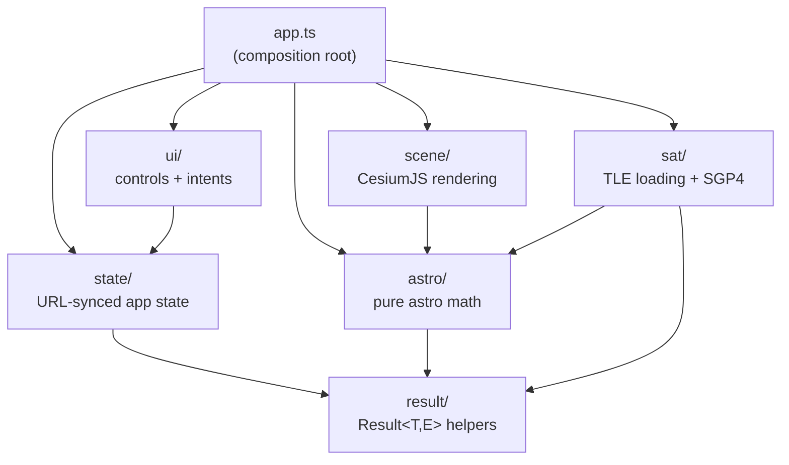
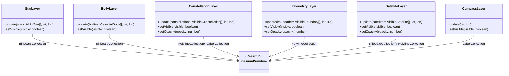

# Architecture

Planisphere is a static single-page application with no backend. All computation runs in the browser. This document describes the module structure, data flow, layer model, and TLE loading strategy.

## Module dependency graph

Each module has a strict boundary. Arrows point from importer to dependency.



**Boundary rules enforced at review:**

- `astro/` and `sat/` are pure and framework-free — no CesiumJS imports, no DOM.
- `scene/` is the only module permitted to import CesiumJS types.
- `ui/` reads `state/` types and emits `UIIntent` values; it does not compute positions.
- `result/` has no dependencies within the project.

## Data flow

The application follows a unidirectional flow: state drives computation, computation drives rendering, and user actions produce intents that update state.

```mermaid
flowchart LR
    URL["URL search params"]
    State["AppState\n(observer, time, layers, opacity)"]
    Astro["astro/\nfilterVisibleStars\ncomputeBodyPositions\nfilterVisibleConstellations\nfilterVisibleBoundaries"]
    Sat["sat/\npropagateSatellites"]
    Scene["scene/\nLayer.update()"]
    UI["ui/\npanel + controls"]
    Intent["UIIntent\n(set-time | set-observer\n| toggle-layer | set-opacity\n| set-view)"]

    URL -->|parseStateFromSearchParams| State
    State -->|observer + timeUtc| Astro
    State -->|observer + timeUtc| Sat
    Astro -->|AltAzStar[], CelestialBody[]\nVisibleConstellation[]\nVisibleBoundary[]| Scene
    Sat -->|VisibleSatellite[]| Scene
    Scene -->|primitives rendered| Browser["Browser / CesiumJS"]
    UI -->|user interaction| Intent
    Intent -->|handleIntent mutates state| State
    State -->|serializeStateToSearchParams| URL
```

On startup `bootstrap()` in `app.ts`:

1. Parses `AppState` from URL search params (defaults used when params are absent).
2. Parses the bundled star catalog (`data/stars.json`).
3. Initialises the CesiumJS viewer and camera.
4. Calls `rerender()` to populate all layers from the initial state.
5. Fetches TLE data asynchronously (see TLE flow below).
6. Mounts the UI panel; each control fires a `UIIntent` that `handleIntent` dispatches.

## Layer architecture

Each visual layer is an opaque object returned by a `create*Layer` factory in `scene/`. Layers own their Cesium primitives directly and expose a minimal interface. `app.ts` calls these methods; no other module does.



`setOpacity` is only present on layers that have a variable-alpha component (constellation lines, constellation boundaries, satellite trails). `StarLayer`, `BodyLayer`, and `CompassLayer` have no opacity slider.

## TLE fetch and fallback flow

Satellite TLE data is fetched at runtime from CelesTrak. If the network request fails or returns empty content the application transparently falls back to a bundled snapshot (`data/tle/visual.txt`) so that satellites are always shown without requiring connectivity.


`fetchTle` always returns `Result<string, never>` (it never propagates errors to the caller — network failures silently fall back). The `TleFetchError` type exists for future use if callers need to distinguish the source.
