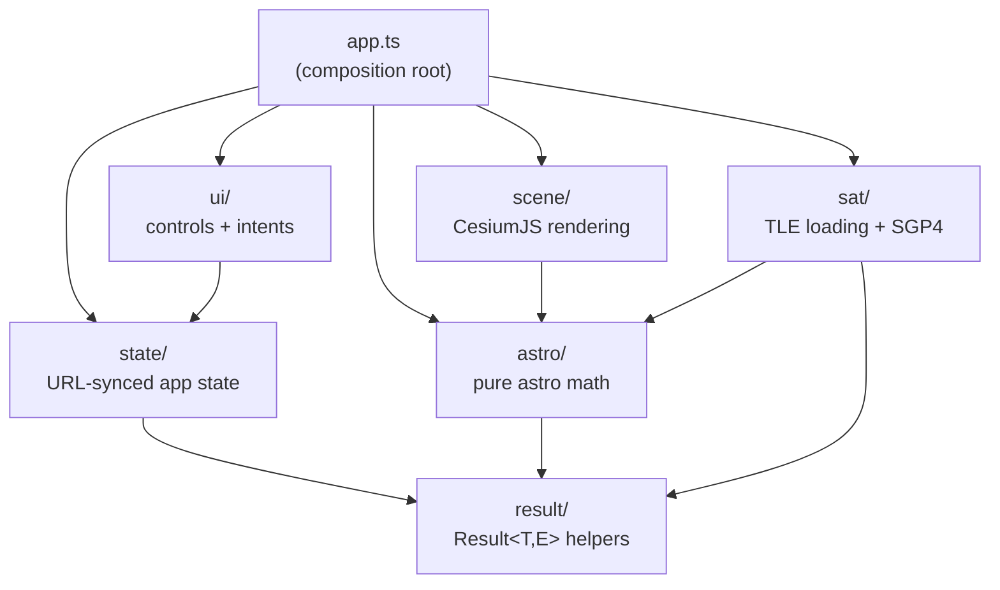
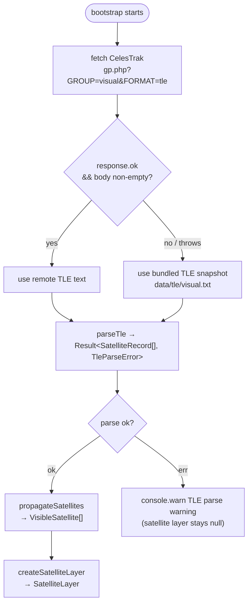

# Architecture

Planisphere is a static single-page application with no backend. All computation runs in the browser. This document describes the module structure, data flow, layer model, and TLE loading strategy.

## Module dependency graph

Each module has a strict boundary. Arrows point from importer to dependency.



**Boundary rules enforced at review:**

- `astro/` and `sat/` are pure and framework-free — no CesiumJS imports, no DOM.
- `scene/` is the only module permitted to import CesiumJS types.
- `ui/` reads `state/` types and emits `UIIntent` values; it does not compute positions.
- `result/` has no dependencies within the project.

## Data flow

The application follows a unidirectional flow: state drives computation, computation drives rendering, and user actions produce intents that update state.

```mermaid
flowchart LR
    URL["URL search params"]
    State["AppState\n(observer, time, layers, opacity)"]
    Astro["astro/\nfilterVisibleStars\ncomputeBodyPositions\nfilterVisibleConstellations\nfilterVisibleBoundaries"]
    Sat["sat/\npropagateSatellites"]
    Scene["scene/\nLayer.update()"]
    UI["ui/\npanel + controls"]
    Intent["UIIntent\n(set-time | set-observer\n| toggle-layer | set-opacity\n| set-view)"]

    URL -->|parseStateFromSearchParams| State
    State -->|observer + timeUtc| Astro
    State -->|observer + timeUtc| Sat
    Astro -->|AltAzStar[], CelestialBody[]\nVisibleConstellation[]\nVisibleBoundary[]| Scene
    Sat -->|VisibleSatellite[]| Scene
    Scene -->|primitives rendered| Browser["Browser / CesiumJS"]
    UI -->|user interaction| Intent
    Intent -->|handleIntent mutates state| State
    State -->|serializeStateToSearchParams| URL
```

On startup `bootstrap()` in `app.ts`:

1. Parses `AppState` from URL search params (defaults used when params are absent).
2. Parses the bundled star catalog (`data/stars.json`).
3. Initialises the CesiumJS viewer and camera.
4. Calls `rerender()` to populate all layers from the initial state.
5. Fetches TLE data asynchronously (see TLE flow below).
6. Mounts the UI panel; each control fires a `UIIntent` that `handleIntent` dispatches.

## Layer architecture

Each visual layer is an opaque object returned by a `create*Layer` factory in `scene/`. Layers own their Cesium primitives directly and expose a minimal interface. `app.ts` calls these methods; no other module does.


`setOpacity` is only present on layers that have a variable-alpha component (constellation lines, constellation boundaries, satellite trails). `StarLayer`, `BodyLayer`, and `CompassLayer` have no opacity slider.

## TLE fetch and fallback flow

Satellite TLE data is fetched at runtime from CelesTrak. If the network request fails or returns empty content the application transparently falls back to a bundled snapshot (`data/tle/visual.txt`) so that satellites are always shown without requiring connectivity.



`fetchTle` always returns `Result<string, never>` (it never propagates errors to the caller — network failures silently fall back). The `TleFetchError` type exists for future use if callers need to distinguish the source.

## Running in development

### Prerequisites

1. **Node 20.11.1** — pinned in `.nvmrc`. Install via nvm:
   ```bash
   nvm install 20.11.1
   nvm use                # reads .nvmrc automatically
   node --version         # should print v20.11.1
   ```
2. **pnpm ≥ 9.12.0** — install via Corepack (ships with Node) or Homebrew:
   ```bash
   brew install corepack
   corepack enable
   corepack prepare pnpm@9.12.0 --activate
   pnpm --version         # should print 9.12.0
   ```

### Install and run

```bash
git clone https://github.com/robsartin/planisphere.git
cd planisphere
pnpm install              # installs all dependencies from pnpm-lock.yaml
pnpm dev                  # starts Vite dev server
```

The dev server runs at `http://localhost:5173`. Open it in a browser. Add URL params to set the view:

```
http://localhost:5173/?lat=30.27&lon=-97.74&t=2026-04-17T04:00:00Z
```

That shows Austin, Texas at pre-dawn — good for seeing satellites.

### How the dev server works

- **Vite** serves the app with hot module replacement (HMR). Edit any file in `src/` and the browser updates instantly without a full reload.
- **vite-plugin-cesium** copies CesiumJS static assets (web workers, default imagery) into the dev server's public path so CesiumJS can find them at runtime.
- **satellite.js workaround:** satellite.js v7 ships a WASM pthreads build that uses top-level `await`, which esbuild (Vite's dev dependency optimizer) rejects. Two fixes are in place:
  - `optimizeDeps.exclude: ["satellite.js"]` in `vite.config.ts` tells Vite not to pre-bundle satellite.js.
  - `stubSatelliteJsWasm()` Vite plugin stubs the unused WASM module for production builds (Rollup).

### Running tests

```bash
pnpm test                 # run all tests once (no coverage)
pnpm test:watch           # run tests in watch mode (re-runs on file change)
pnpm vitest run src/sat/  # run tests for a specific module
```

Tests use **Vitest** with **jsdom** as the test environment. CesiumJS is mocked in every test file that imports scene modules (CesiumJS requires WebGL which jsdom doesn't have). The mocking pattern is consistent across all `*.test.ts` files — look at any `src/scene/*.test.ts` for examples.

### Running tests with coverage

```bash
pnpm test:cov             # run tests + enforce coverage thresholds
```

This uses **@vitest/coverage-v8** (V8's built-in coverage). After running, it:

1. Prints a coverage table to the terminal showing per-file line/branch/function/statement percentages.
2. Generates an HTML report in `coverage/` (open `coverage/index.html` in a browser for a detailed view).
3. **Checks per-directory thresholds** — if any module falls below its minimum, the command exits with a non-zero code and prints `ERROR: Coverage for lines (X%) does not meet "src/foo/**" threshold (Y%)`.

Coverage thresholds are defined in `vitest.config.ts`:

| Module          | Lines | Branches | Rationale                               |
| --------------- | ----- | -------- | --------------------------------------- |
| `src/result/**` | ≥ 90% | ≥ 85%    | Pure logic, fully testable              |
| `src/state/**`  | ≥ 90% | ≥ 85%    | Pure logic, fully testable              |
| `src/astro/**`  | ≥ 90% | ≥ 85%    | Pure math, fully testable               |
| `src/sat/**`    | ≥ 90% | ≥ 85%    | Pure logic, fully testable              |
| `src/scene/**`  | ≥ 80% | ≥ 70%    | Mocked Cesium limits coverage           |
| `src/ui/**`     | ≥ 80% | ≥ 70%    | DOM tests, harder to cover exhaustively |
| `src/app.ts`    | ≥ 80% | ≥ 70%    | Integration module                      |
| Project floor   | ≥ 85% | ≥ 80%    | Safety net for any unlisted files       |

**Never lower a threshold to make a PR pass.** Add tests or narrow the change instead.

### Code formatting

```bash
pnpm format:check         # check if all files match Prettier's style (no changes)
pnpm format               # auto-fix all files to match Prettier's style
```

**Prettier** enforces consistent formatting across all source files. Configuration is in `.prettierrc.json`:

- Semicolons: yes
- Quotes: double
- Trailing commas: all
- Print width: 100 characters
- Arrow parens: always

Files excluded from formatting are listed in `.prettierignore` (dist, coverage, worktrees, public, lockfile).

### Linting

```bash
pnpm lint                 # ESLint + SPDX header check
pnpm lint:spdx            # SPDX header check only
```

`pnpm lint` runs two things in sequence:

1. **ESLint** with `@typescript-eslint/recommended-type-checked` rules and zero-warning tolerance (`--max-warnings=0`). Key rules:

   - `consistent-type-imports` — enforces `import type` for type-only imports.
   - `no-floating-promises` — catches unhandled async calls.
   - `no-explicit-any` — no `any` type anywhere; use `unknown` + type guards.
   - `eqeqeq` — no `==`, always `===`.
   - `no-console` — warns on `console.log` (only `console.warn` and `console.error` allowed).

2. **SPDX header check** (`scripts/check-spdx.mjs`) — verifies every `.ts` file in `src/` and every `.mjs` in `scripts/` has `/* SPDX-License-Identifier: Apache-2.0 */` as its first line. Required for Apache 2.0 compliance.

### Building for production

```bash
pnpm build                # typecheck + Vite production build
```

This runs `tsc --noEmit` (typecheck) then `vite build`. The output goes to `dist/`:

- `dist/index.html` — the SPA entry point
- `dist/assets/index-*.js` — the bundled JavaScript (~480KB, ~148KB gzipped)
- `dist/assets/index-*.css` — Cesium widget styles (~24KB)
- `dist/cesium/` — CesiumJS workers and static assets (copied by vite-plugin-cesium)

The `dist/` directory is what gets deployed. It's a fully static site — no server-side code, no API calls (except the optional TLE fetch from CelesTrak).

### The full quality gate

Before any code reaches `main`, it must pass all five checks:

```bash
pnpm typecheck && pnpm format:check && pnpm lint && pnpm test:cov && pnpm build
```

This is enforced at three levels:

1. **Locally (Claude Code hooks):** Pre-commit hook runs `typecheck + format:check + lint + test:cov`. Pre-push and pre-PR-create hooks run all five including `build`. Configured in `.claude/settings.json`.
2. **CI (GitHub Actions):** Four parallel jobs run on every PR and push to `main`. See CI section below.
3. **Branch protection:** `main` requires all four CI jobs to pass before merge.

### Regenerating data files

Four data files in `data/` are pre-built from external sources. To refresh:

```bash
node scripts/build-star-catalog.mjs     # ~5000 stars from HYG database → data/stars.json
node scripts/build-constellations.mjs   # 88 constellations from Stellarium → data/constellations.json
node scripts/build-boundaries.mjs       # 89 boundary polygons from d3-celestial → data/boundaries.json
node scripts/build-tle.mjs              # ~150 visual satellites from CelesTrak → data/tle/visual.txt
```

Each script fetches from an external URL and writes a committed data file. Internet access required.

| Data file                  | Source                        | Refresh cadence                             |
| -------------------------- | ----------------------------- | ------------------------------------------- |
| `data/stars.json`          | HYG Database (Hipparcos)      | Never (catalog is fixed)                    |
| `data/constellations.json` | Stellarium v23.4              | Never (IAU stick figures are fixed)         |
| `data/boundaries.json`     | d3-celestial (IAU boundaries) | Never (boundaries are fixed)                |
| `data/tle/visual.txt`      | CelesTrak                     | Weekly or before demos (TLEs decay in days) |

The app also fetches TLE data at runtime from CelesTrak — the bundled file is a fallback for when that fetch fails.

## CI — GitHub Actions

### What runs and when

`.github/workflows/ci.yml` triggers on every push to `main` and every pull request targeting `main`. It runs four jobs **in parallel** on `ubuntu-latest`:

| Job         | Commands                          | What it checks                                           | Artifacts            |
| ----------- | --------------------------------- | -------------------------------------------------------- | -------------------- |
| `typecheck` | `pnpm typecheck`                  | TypeScript strict mode, no type errors                   | None                 |
| `lint`      | `pnpm lint` + `pnpm format:check` | ESLint zero warnings, SPDX headers, Prettier conformance | None                 |
| `test`      | `pnpm test:cov`                   | All tests pass, all coverage thresholds met              | `coverage/` uploaded |
| `build`     | `pnpm build`                      | Production build succeeds, no build errors               | `dist/` uploaded     |

Each job independently:

1. Checks out the code (`actions/checkout@v4`).
2. Installs pnpm 9.12.0 (`pnpm/action-setup@v4`).
3. Sets up Node from `.nvmrc` with pnpm cache (`actions/setup-node@v4`).
4. Runs `pnpm install --frozen-lockfile` (fails if lockfile is out of date).
5. Runs its specific check.

### What happens on a PR

When you open a PR or push to a PR branch:

1. All four CI jobs start within seconds.
2. GitHub shows check status on the PR page (green checkmarks or red X's).
3. **Cloudflare Workers Builds** also runs — it builds and deploys a **preview** of the PR. The preview URL appears as a check on the PR (click "Details" to open it).
4. Branch protection blocks merge until all four CI jobs pass. The Cloudflare build is not a required check.

### What happens on merge to main

When a PR is merged (squash-merge):

1. CI runs again on the merge commit (push to `main`).
2. Cloudflare deploys the merge commit to **production**.
3. The merged branch is auto-deleted (GitHub repo setting `delete_branch_on_merge: true`).

### Branch protection rules

`main` is protected via GitHub's branch protection API (`scripts/protect-main.sh`):

- **Required status checks:** `typecheck`, `lint`, `test`, `build` — all must pass.
- **Strict status checks:** branch must be up-to-date with `main` before merge.
- **Required reviews:** 0 (single-developer project).
- **Linear history:** enforced (no merge commits — squash-merge only).
- **Force pushes:** disabled.
- **Branch deletion:** disabled.

To re-apply or update protection rules:

```bash
bash scripts/protect-main.sh robsartin/planisphere
```

## Deployment — Cloudflare Pages

### Current setup

The app deploys to **Cloudflare Pages** via the **Cloudflare Git integration** — Cloudflare watches the GitHub repo directly and builds on every push. No GitHub Actions deploy workflow is needed.

### How a deploy works

1. Code is pushed to GitHub (directly to `main`, or a PR branch).
2. Cloudflare detects the push via its GitHub App integration.
3. Cloudflare clones the repo, installs dependencies (`pnpm install`), and runs the build (`pnpm build`).
4. The contents of `dist/` are uploaded to Cloudflare's edge network.
5. The site is live within seconds at the assigned URL.

For PRs, Cloudflare creates a **preview deployment** with a unique URL (e.g., `abc123.planisphere.pages.dev`). For pushes to `main`, it updates the **production deployment**.

### Configuration

| File             | Purpose                                                                                               |
| ---------------- | ----------------------------------------------------------------------------------------------------- |
| `wrangler.jsonc` | Tells Cloudflare the project name (`planisphere`), compatibility date, and asset directory (`./dist`) |
| `.nvmrc`         | Cloudflare reads this to determine which Node version to use for the build                            |
| `package.json`   | Cloudflare runs `pnpm build` (the `build` script)                                                     |

### Setting up a production domain

When you're ready to put the planisphere on a custom domain (e.g., `planisphere.example.com`):

1. **In Cloudflare Pages dashboard** (Pages → planisphere → Custom domains):

   - Click "Set up a custom domain".
   - Enter your domain (e.g., `planisphere.example.com`).
   - Cloudflare will provide DNS instructions.

2. **If the domain is on Cloudflare DNS** (easiest):

   - Cloudflare auto-creates the CNAME record. SSL is provisioned automatically.
   - The site is live at the custom domain within minutes.

3. **If the domain is on an external DNS provider:**

   - Add a CNAME record: `planisphere` → `planisphere.pages.dev`.
   - Wait for DNS propagation (up to 48 hours, usually minutes).
   - Cloudflare provisions an SSL certificate via Let's Encrypt automatically.

4. **Production vs preview URLs after custom domain:**
   - Production: `https://planisphere.example.com` (or whatever domain you set).
   - PR previews: still use the `*.planisphere.pages.dev` subdomain format.

### Required GitHub secrets

| Secret                  | Purpose                            | How to get it                                                                                      |
| ----------------------- | ---------------------------------- | -------------------------------------------------------------------------------------------------- |
| `CLOUDFLARE_API_TOKEN`  | Authenticates the Git integration  | Cloudflare dashboard → My Profile → API Tokens → Create Token → "Cloudflare Pages:Edit" permission |
| `CLOUDFLARE_ACCOUNT_ID` | Identifies your Cloudflare account | Cloudflare dashboard → any zone → Overview → right sidebar → Account ID                            |

These secrets are already configured in the `robsartin/planisphere` repo. They're used by Cloudflare's Git integration, not by any GitHub Actions workflow.

### Monitoring deploys

- **Cloudflare dashboard:** Pages → planisphere → Deployments. Shows all deploys with status, build logs, and URLs.
- **GitHub PR checks:** The "Workers Builds: planisphere" check shows pass/fail and links to the Cloudflare build log.
- **Production URL:** After deploy, the site is live immediately. No cache invalidation needed — Cloudflare handles it.
