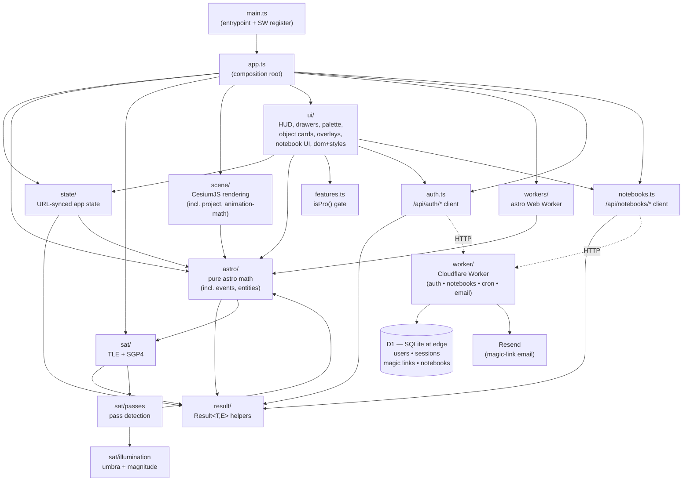
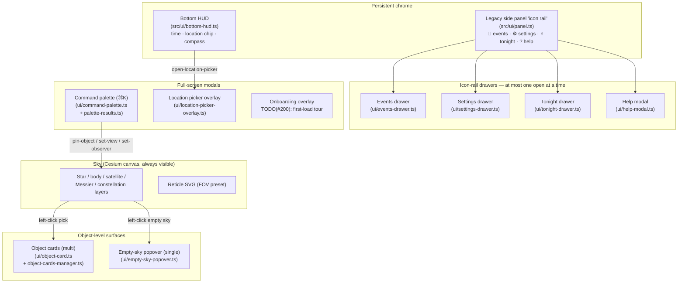
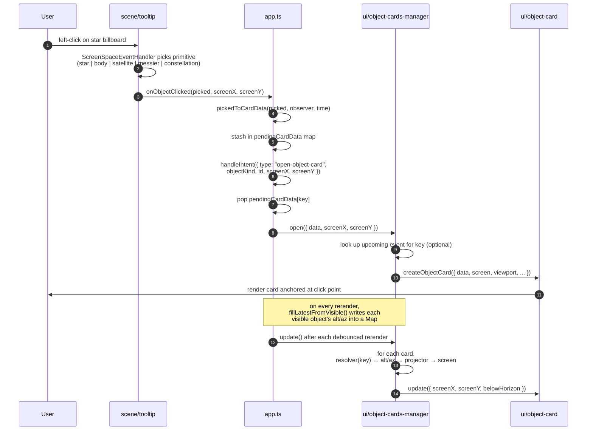
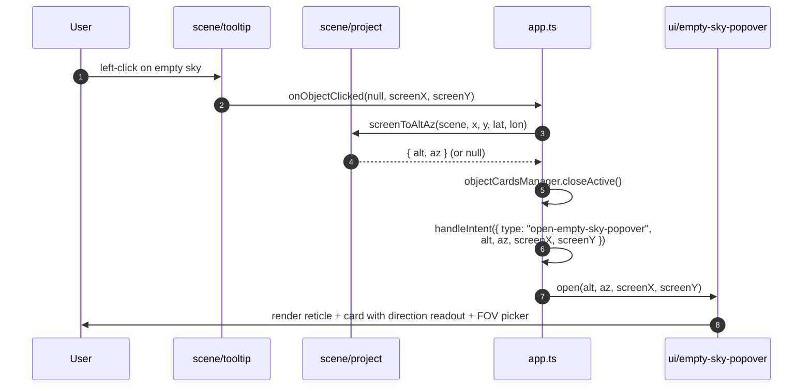
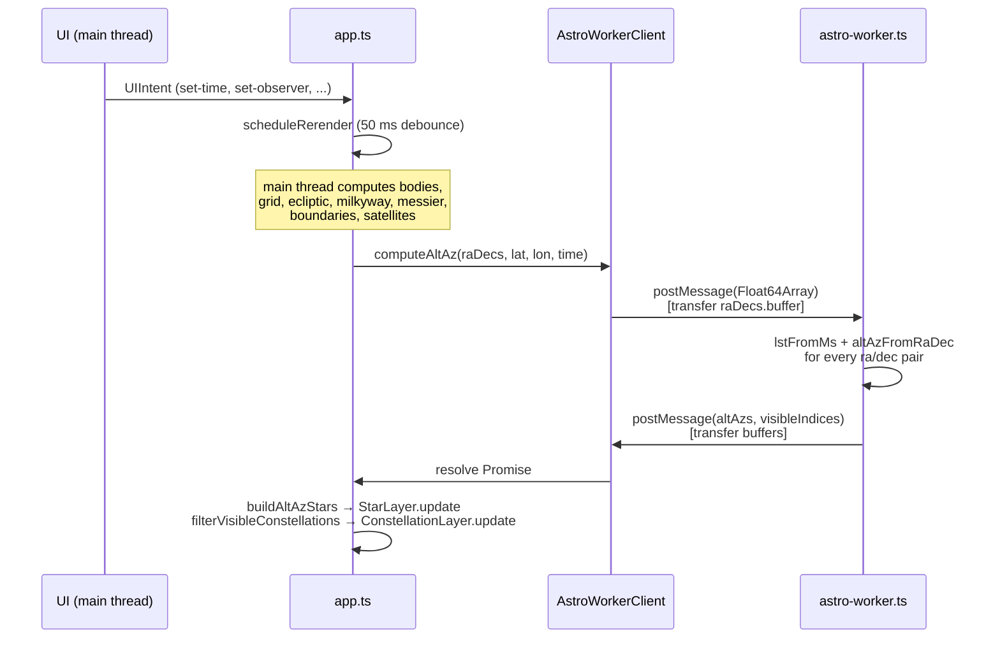
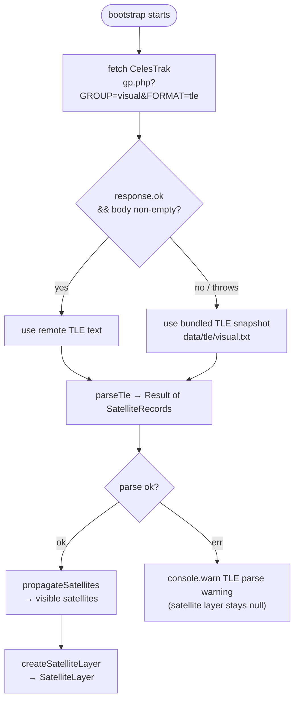
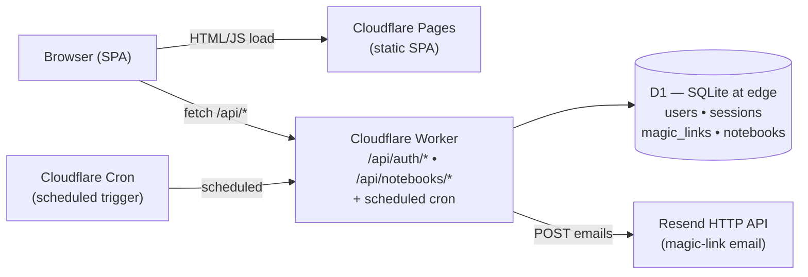

# Architecture

Planisphere is a static single-page application with a small Cloudflare Worker behind `/api/*` for the Phase 2 Notebook feature. All astronomy computation runs in the browser; the Worker only handles auth, notebook persistence, and email. This document describes the module structure, data flow, layer model, worker offload, TLE loading strategy, the post-v1 feature subsystems, and the Phase 2 backend.

The v1 baseline design lives in `docs/specs/2026-04-15-planisphere-v1-design.md`. Everything in this file reflects the current state of the repo, including features added since v1 (star colors, Milky Way, Messier, search, planet info, RA/Dec grid + ecliptic, boundaries, view direction controls, trackball camera, Web Worker, fast RA/Dec math, PWA/service worker, copy-link, night vision, magnitude filter, "Now" button, object trails, multi-language constellation names, telescope FOV reticle, upcoming-celestial-events panel, ISS pass predictions with illumination, alternate skycultures, in-app help modal).

Plan 07 (`docs/plans/2026-04-19-07-ux-transformation.md`) then reshaped the chrome entirely: the always-on side panel that used to carry Time / Events / Layers / Planet Info has been replaced by an ambient bottom HUD, four icon-rail drawers (events / settings / tonight's sky / help), a ⌘K command palette, click-to-pin object cards, and an empty-sky reticle popover. The computation layers in `astro/` and `sat/` are unchanged — Phase 1 is purely a UI / chrome refactor. Phase 2 adds a paid **Notebook mode** with magic-link email auth and tiptap-based notes persisted to Cloudflare D1 via a companion Worker. See [UX architecture](#ux-architecture) and [Worker backend (Phase 2)](#worker-backend-phase-2) below.

For the chronological decision trail see the [ADR index](./adr/README.md).

## Module dependency graph

Each module has a strict boundary. Arrows point from importer to dependency.



**Boundary rules enforced at review:**

- `astro/` and `sat/` are pure and framework-free — no CesiumJS imports, no DOM.
- `scene/` is the only module permitted to import CesiumJS types.
- `ui/` reads `state/` types and emits `UIIntent` values; it does not compute positions and it never calls `fetch` against `/api/*` directly.
- `workers/` is the only module that constructs `Worker` instances. The worker entry (`src/workers/astro-worker.ts`) imports only from `src/workers/worker-math.ts` and has no DOM, Cesium, or astronomy-engine dependencies.
- `result/` has no dependencies within the project.
- `state/` imports narrow types from `astro/` (`Language`, `FovPresetId`, `SkycultureId`) for URL parsing but no math.
- `astro/events.ts` is the one place in `astro/` that reaches into `sat/` — it imports `computeUpcomingPasses` and `isIssRecord` so the combined upcoming-events list can include ISS passes without `ui/` having to orchestrate two separate sources. `sat/` does not depend on `astro/events` (the edge goes one way).
- `src/auth.ts` and `src/notebooks.ts` are the **only** client modules that call `/api/*`. They convert HTTP responses to `Result<T, AuthError | NotebookError>` at the boundary; everything else in `src/` consumes the typed domain union.
- `worker/` has no DOM, no Cesium, no `src/*` imports. It runs against D1 + Resend and is tested under `@cloudflare/vitest-pool-workers`.

## Module inventory

Per-module summary of what lives where. Filenames omit the `.ts` extension; each module also has a `*.test.ts` sibling.

| Module              | Files                                                                                                                                                                                                                                                                                                                                                                                                                                                                                                                                                                                                                                                                                                                             | Responsibility                                                                                                                                                                                                                                                                                                                                    |
| ------------------- | --------------------------------------------------------------------------------------------------------------------------------------------------------------------------------------------------------------------------------------------------------------------------------------------------------------------------------------------------------------------------------------------------------------------------------------------------------------------------------------------------------------------------------------------------------------------------------------------------------------------------------------------------------------------------------------------------------------------------------- | ------------------------------------------------------------------------------------------------------------------------------------------------------------------------------------------------------------------------------------------------------------------------------------------------------------------------------------------------- |
| `src/result/`       | `result`                                                                                                                                                                                                                                                                                                                                                                                                                                                                                                                                                                                                                                                                                                                          | `Result<T, E>` discriminated union, `ok`/`err` helpers.                                                                                                                                                                                                                                                                                           |
| `src/state/`        | `state`                                                                                                                                                                                                                                                                                                                                                                                                                                                                                                                                                                                                                                                                                                                           | `AppState`, URL parse/serialize, defaults.                                                                                                                                                                                                                                                                                                        |
| `src/astro/`        | `catalog`, `coords`, `fast-coords`, `magnitude`, `visibility`, `moon-phase`, `bodies`, `rise-set`, `constellations`, `boundaries`, `grid`, `ecliptic`, `star-color`, `messier`, `milkyway`, `trails`, `constellation-names`, `fov-presets`, `search`, `skycultures`, `entities`, `events`                                                                                                                                                                                                                                                                                                                                                                                                                                         | Pure astronomy math. No DOM, no Cesium, no `Worker`. `entities` resolves a stable `kind:id` string to a labelled record (bodies, stars, constellations, deep-sky, satellites) — shared by the search index and the notebook mention popover. `events` composes the upcoming-events list (reaches into `sat/passes` for ISS passes).               |
| `src/sat/`          | `fetch`, `tle`, `propagate`, `passes`, `illumination`                                                                                                                                                                                                                                                                                                                                                                                                                                                                                                                                                                                                                                                                             | TLE fetch with bundled fallback, TLE parsing to `SatelliteRecord`, SGP4 propagation to Alt/Az, per-satellite pass detection, umbra/magnitude model.                                                                                                                                                                                               |
| `src/scene/`        | `viewer`, `camera`, `animation-math`, `project`, `cesium-collections`, `stars`, `bodies`, `constellations`, `boundaries`, `satellites`, `compass`, `grid`, `ecliptic`, `messier`, `milkyway`, `trail-layer`, `reticle`, `tooltip`                                                                                                                                                                                                                                                                                                                                                                                                                                                                                                 | CesiumJS primitives, one `create*Layer` factory per visual layer, camera + gesture setup, screen↔sky projection. `animation-math` is pure (FOV clamp, ease-out cubic, az/alt lerp, drag-inertia integral); `project` exposes `projectAltAzToScreen` / `screenToAltAz`; `cesium-collections` centralises the `setCollectionVisible` cast helpers.  |
| `src/ui/`           | **Shared primitives:** `dom` (`el()` factory), `styles` (palette + `applyButton` / `applyBaseText` / `createProPill`), `error-messages`, `markdown`. **Chrome:** `bottom-hud`, `drawer`, `events-drawer`, `settings-drawer`, `tonight-drawer`, `help-modal`, `command-palette`, `palette-results`, `location-picker-overlay`, `empty-sky-popover`, `onboarding-overlay`, `object-card`, `object-cards-manager`, `panel`. **Controls** (still rendered inside `panel`): `time-controls`, `location-controls`, `view-controls`, `layer-controls`, `planet-info`, `search`, `fov-controls`, `events-panel`. **Notebook UI:** `login-modal`, `notebook-workspace`, `notebook-editor`, `notebook-mention`, `notebook-mention-popover`. | DOM chrome + controls, `UIIntent` union, layout/styles, Notebook surface. After Plan 07 the drawers / palette / cards are the primary surfaces; the legacy `panel` still hosts search / view / location / FOV and wires the icon-rail buttons through to the drawers. The notebook UI appears only in Notebook mode (toggled via the panel icon). |
| `src/workers/`      | `astro-worker`, `astro-worker-client`, `worker-math`, `star-builder`                                                                                                                                                                                                                                                                                                                                                                                                                                                                                                                                                                                                                                                              | Web Worker for star alt/az math; pure math extracted for testing; array builders that bridge `StarRecord[]` ↔ transferable `Float64Array`.                                                                                                                                                                                                        |
| `src/auth.ts`       | —                                                                                                                                                                                                                                                                                                                                                                                                                                                                                                                                                                                                                                                                                                                                 | Client wrapper for `/api/auth/*` (request magic link, consume callback, `currentUser()`, logout). Returns `Result<T, AuthError>`.                                                                                                                                                                                                                 |
| `src/notebooks.ts`  | —                                                                                                                                                                                                                                                                                                                                                                                                                                                                                                                                                                                                                                                                                                                                 | Client wrapper for `/api/notebooks/*` (list / get / create / update / delete). Carries a tiptap JSON string as opaque `content_json`. Returns `Result<T, NotebookError>`.                                                                                                                                                                         |
| `src/features.ts`   | —                                                                                                                                                                                                                                                                                                                                                                                                                                                                                                                                                                                                                                                                                                                                 | Runtime feature flags. Currently exposes `isPro()` — the Notebook gate — so UI modules can show a Pro pill or silently allow entry.                                                                                                                                                                                                               |
| `src/app.ts`        | —                                                                                                                                                                                                                                                                                                                                                                                                                                                                                                                                                                                                                                                                                                                                 | Composition root. Wires state → computation → layers → UI; debounced rerender; intent dispatch; trail and reticle orchestration; search index rebuild; mode toggle (planetarium ↔ notebook).                                                                                                                                                      |
| `src/main.ts`       | —                                                                                                                                                                                                                                                                                                                                                                                                                                                                                                                                                                                                                                                                                                                                 | Browser entrypoint. Calls `bootstrap()` and registers the service worker (`/sw.js`) only when `import.meta.env.PROD` is true.                                                                                                                                                                                                                     |
| `src/test-setup.ts` | —                                                                                                                                                                                                                                                                                                                                                                                                                                                                                                                                                                                                                                                                                                                                 | Vitest setup file — installs a no-op `HTMLCanvasElement.getContext("2d")` stub so scene-layer sprite builders (compass, messier, satellites) don't flood stderr under jsdom. See [Test environment](#test-environment).                                                                                                                           |
| `worker/`           | `index`, `routes/auth`, `routes/notebooks`, `session`, `db`, `email`, `http`, `log`, `crypto`, `types`                                                                                                                                                                                                                                                                                                                                                                                                                                                                                                                                                                                                                            | Phase 2 Cloudflare Worker — magic-link auth, notebook CRUD, HMAC-signed session cookies, cron sweep for expired links/sessions, Resend email delivery, structured logging. See [Worker backend (Phase 2)](#worker-backend-phase-2).                                                                                                               |

## Data flow

The application follows a unidirectional flow: state drives computation, computation drives rendering, and user actions produce intents that update state. The heavy star math is offloaded to a Web Worker on all rerenders after the first.

```mermaid
flowchart LR
    URL["URL search params"]
    State["AppState\n(observer, time, layers, opacity,\nview, nightVision, magLimit,\nlanguage, fov, skyculture)"]
    Astro["astro/ (main thread)\nfilterVisibleBoundaries\ncomputeBodyPositions\ncomputeRaDecGrid\ncomputeEclipticLine\ncomputeMilkyWayPoints\nfilterVisibleMessier\ncomputeBodyTrail\nfilterVisibleConstellations\nfilterVisibleAsterisms (non-Western)"]
    Events["astro/events\ncomputeUpcomingEvents\n(conjunctions, eclipses,\nshowers, ISS passes)"]
    Worker["workers/astro-worker\n(alt/az for ~5000 stars)"]
    Sat["sat/\npropagateSatellites\ncomputeUpcomingPasses"]
    Scene["scene/\nLayer.update()"]
    UI["ui/\npanel + controls + search\nevents-panel"]
    Intent["UIIntent"]

    URL -->|parseStateFromSearchParams| State
    State -->|observer + timeUtc + magLimit| Astro
    State -->|RA/Dec catalog + observer + time| Worker
    State -->|observer + timeUtc| Sat
    State -->|observer + timeUtc + TLE| Events
    Events -->|sat records| Sat
    Astro -->|lines, bodies, grid, ecliptic,\nmilkyway, messier, trail,\nboundaries, asterisms| Scene
    Worker -->|altAzs + visibleIndices| Scene
    Sat -->|visible satellites| Scene
    Events -->|CelestialEvent[]| UI
    Scene -->|primitives rendered| Browser["Browser / CesiumJS"]
    UI -->|user interaction| Intent
    Intent -->|handleIntent mutates state| State
    State -->|serializeStateToSearchParams| URL
```

On startup `bootstrap()` in `app.ts`:

1. Parses `AppState` from URL search params via `parseStateFromSearchParams` (defaults used when params are absent). When `?t` is absent the default is the real "now" so upcoming events open on the current moment.
2. Parses the bundled star catalog (`data/stars.json`), constellation stick figures, boundaries, Messier catalog, and — if the state's `skyculture` is non-Western — the selected asterism set from `data/asterisms/<id>.json`.
3. Initialises the CesiumJS viewer, applies the initial `view` (az/alt) from state, and wires up trackball drag controls (see `src/scene/camera.ts`).
4. Creates every scene layer up front (stars, bodies, constellations, boundaries, compass, grid, ecliptic, messier, milkyway, trail, reticle). The satellite layer is created later, once TLE data is available.
5. Runs a synchronous initial `doRerender` so the sky appears instantly.
6. Tries to spin up an `AstroWorkerClient`; if construction fails (test environment, bundler restriction) it falls back to synchronous rerenders.
7. Fetches TLE data asynchronously and creates the satellite layer on success (see TLE flow below). The same `SatelliteRecord[]` is passed into `computeUpcomingEvents` so the events panel can include ISS passes.
8. Builds the search index over named stars, constellations, bodies, and satellites.
9. Mounts the UI panel (time, events, location, view, FOV, layers, planet info, search box) plus the Copy link and Night vision buttons in the header. Each control fires a `UIIntent` that `handleIntent` dispatches.
10. `scheduleRerender` debounces subsequent state changes with a 50 ms timeout and routes them through the worker when available. The events panel is refreshed separately — only on `set-time`, `set-observer`, and `now` — because events depend on `now` and observer but not on layer / view / opacity state.

## Layer architecture

Each visual layer is an opaque object returned by a `create*Layer` factory in `src/scene/`. Layers own their Cesium primitives directly and expose a minimal interface. `app.ts` calls these methods; no other module does.

```mermaid
classDiagram
    class StarLayer {
        +update(stars: AltAzStar[], lat, lon)
        +setVisible(visible)
    }
    class BodyLayer {
        +update(bodies, lat, lon)
        +setVisible(visible)
    }
    class ConstellationLayer {
        +update(constellations, lat, lon)
        +setNameOverrides(map | null)
        +setVisible(visible)
        +setOpacity(opacity)
    }
    class BoundaryLayer {
        +update(boundaries, lat, lon)
        +setVisible(visible)
        +setOpacity(opacity)
    }
    class SatelliteLayer {
        +update(satellites, lat, lon)
        +setVisible(visible)
        +setOpacity(opacity)
    }
    class CompassLayer {
        +update(lat, lon)
        +setVisible(visible)
    }
    class GridLayer {
        +update(gridData, lat, lon)
        +setOpacity(opacity)
    }
    class EclipticLayer {
        +update(points, lat, lon)
        +setOpacity(opacity)
    }
    class MessierLayer {
        +update(objects, lat, lon)
        +setVisible(visible)
        +setOpacity(opacity)
    }
    class MilkyWayLayer {
        +update(points, lat, lon)
        +setOpacity(opacity)
    }
    class TrailLayer {
        +setPoints(points, lat, lon)
        +show()
        +hide()
    }
    class ReticleLayer {
        +setPreset(FovPresetId)
        +destroy()
    }
    class CesiumPrimitive {
        <<CesiumJS>>
    }

    StarLayer --> CesiumPrimitive : BillboardCollection
    BodyLayer --> CesiumPrimitive : BillboardCollection
    ConstellationLayer --> CesiumPrimitive : PolylineCollection\nLabelCollection
    BoundaryLayer --> CesiumPrimitive : PolylineCollection
    SatelliteLayer --> CesiumPrimitive : BillboardCollection\nPolylineCollection
    CompassLayer --> CesiumPrimitive : LabelCollection
    GridLayer --> CesiumPrimitive : PolylineCollection
    EclipticLayer --> CesiumPrimitive : PolylineCollection
    MessierLayer --> CesiumPrimitive : BillboardCollection
    MilkyWayLayer --> CesiumPrimitive : BillboardCollection
    TrailLayer --> CesiumPrimitive : PolylineCollection\n(PolylineDash material)
    ReticleLayer --> DOM : SVG overlay on Cesium canvas
```



`setVisible` is only present on toggleable layers (stars, planets/bodies, satellites, compass, deep-sky/Messier). Overlays controlled purely by opacity (grid, ecliptic, milky way, constellation lines/boundaries, satellite trails) fade to zero rather than being hidden outright. `TrailLayer` is the only layer with a `show`/`hide` API — it is driven by a transient selection from the planet-info panel, not by persisted state.

The reticle is an SVG element sibling to the Cesium canvas; it is not a Cesium primitive but is treated as a layer for consistency. See [Telescope FOV reticle](#telescope-fov-reticle).

## AppState and URL parameters

`AppState` in `src/state/state.ts` is the single source of truth for everything the URL can represent. Every shape in the tree is `readonly`; `handleIntent` builds a new `AppState` on each change.

```ts
type AppState = {
  observer: { lat: number; lon: number };
  timeUtc: Date;
  layers: LayerVisibility; // 5 toggles: stars, planets, satellites, compass, deepSky
  opacity: LayerOpacity; // 6 sliders: constellationLines, constellationBoundaries,
  //            satelliteTrails, raDecGrid, ecliptic, milkyWay
  view: { az: number; alt: number };
  nightVision: boolean;
  magLimit: number; // 1.0–6.0, default 6.0
  language: Language; // "la" | "en" | "zh" | "ar" | "el"
  fov: FovPresetId; // "off" | "naked-eye" | "binoculars" | "small-scope" | "large-scope"
  skyculture: SkycultureId; // "western" | "chinese" | "indian" | "norse_edda"
  //                         | "hawaiian_starlines" | "maori"
};
```

Only fields that differ from their default are written to the URL, so a freshly-loaded app produces a short, human-readable link.

| Param | Type | State slice | Notes |
| --------- | ------------------- | --------------------------------- | --------------------------------------------------------------------------------- | ----------- | ------------------ | ---------- | --------------------------- | ----------------------------------------------------------------------------------------- |
| `lat` | `number` (−90…90) | `observer.lat` | Always written. |
| `lon` | `number` (−180…180) | `observer.lon` | Always written. |
| `t` | ISO 8601 string | `timeUtc` | Always written. |
| `layers` | comma list | `layers` | Omitted when every layer is on. Keys: `stars,planets,satellites,compass,deepSky`. |
| `op_cl` | integer 0–100 | `opacity.constellationLines` | Omitted at default. |
| `op_cb` | integer 0–100 | `opacity.constellationBoundaries` | Omitted at default. |
| `op_st` | integer 0–100 | `opacity.satelliteTrails` | Omitted at default. |
| `op_grid` | integer 0–100 | `opacity.raDecGrid` | Omitted at default (20). |
| `op_ecl` | integer 0–100 | `opacity.ecliptic` | Omitted at default (40). |
| `op_mw` | integer 0–100 | `opacity.milkyWay` | Omitted at default (30). |
| `vaz` | `number` (0–360) | `view.az` | Written when `view` differs from zenith default. |
| `valt` | `number` (0–90) | `view.alt` | Written when `view` differs from zenith default. |
| `nv` | `"1"` when on | `nightVision` | Omitted when off. |
| `mag` | `number` (1.0–6.0) | `magLimit` | Omitted at default (6.0). |
| `lang` | `la                 | en                                | zh                                                                                | ar          | el` | `language` | Omitted at default (`la`). |
| `fov` | `off                | naked-eye                         | binoculars                                                                        | small-scope | large-scope` | `fov` | Omitted at default (`off`). |
| `sky` | `western            | chinese                           | indian                                                                            | norse_edda  | hawaiian_starlines | maori` | `skyculture` | Omitted at default (`western`). Selects the bundled asterism set under `data/asterisms/`. |

Parse and serialize are pure and returned as `Result<AppState, StateParseError>`; `handleIntent` in `app.ts` is the only place that re-serializes back into the URL (via `history.replaceState`).

**Phase 1 adds no new URL params.** Every Phase 1 surface (drawers, cards, palette, popover) is session-local by design — open drawers and pinned cards don't survive a reload. The palette's recents list is the single non-URL persistence introduced, and it lives in `localStorage` (`planisphere.palette.recents.v1`), deliberately outside the shareable-snapshot contract.

## Intents

The UI never mutates `AppState` directly. It emits a typed `UIIntent` (see `src/ui/index.ts`) that the composition root handles. Plan 07 grew the union from thirteen to twenty variants; rather than print the full `ts` union, the table below groups them by what they drive.

| Intent                      | Fields                                   | Updates state? | Handler behaviour (`src/app.ts::handleIntent`)                                                                                                                 |
| --------------------------- | ---------------------------------------- | -------------- | -------------------------------------------------------------------------------------------------------------------------------------------------------------- |
| `set-time`                  | `time: Date`                             | yes            | Rerender sky, refresh tonight + events drawers, rebuild search index, rerender trail, update HUD + URL.                                                        |
| `set-observer`              | `lat`, `lon`                             | yes            | Reset camera, rerender, refresh tonight + events, rebuild search index, rerender trail, update HUD + URL.                                                      |
| `toggle-layer`              | `layer: keyof LayerVisibility`           | yes            | Flip a visibility flag (stars/planets/satellites/compass/deepSky); no full rerender, just `applyLayerVisibility`.                                              |
| `set-opacity`               | `layer: keyof LayerOpacity`, `value`     | yes            | Push opacity straight into the corresponding layer (no recompute).                                                                                             |
| `set-view`                  | `az`, `alt`                              | yes            | `setCameraView` + URL.                                                                                                                                         |
| `toggle-night-vision`       | —                                        | yes            | Toggle `<body>.night-vision` class; mirror to legacy side panel.                                                                                               |
| `set-mag-limit`             | `value`                                  | yes            | Rerender (star filter runs inside `buildAltAzStars`).                                                                                                          |
| `show-trail` / `hide-trail` | `objectKind`, `id` / —                   | no (ephemeral) | Drive `TrailLayer`; refresh tonight drawer so its active-row chevron flips.                                                                                    |
| `set-language`              | `language`                               | yes            | Language implies Western skyculture — `activeAsterisms` is reset to null, name overrides reloaded, rerender.                                                   |
| `set-skyculture`            | `id`                                     | yes            | Load alt asterism set (or null for Western), rerender.                                                                                                         |
| `set-fov`                   | `preset`                                 | yes            | Push preset into `ReticleLayer`.                                                                                                                               |
| `now`                       | —                                        | yes            | Set `timeUtc = new Date()` immediately, then try `navigator.geolocation`; on success dispatch an observer update.                                              |
| `open-location-picker`      | —                                        | no             | Open the location-picker overlay (Plan 07 1B).                                                                                                                 |
| `toggle-animation`          | —                                        | no             | Stub for Plan 08 / issue #136 (time-advance loop). Currently no-op with a `TODO` comment.                                                                      |
| `pin-object`                | `id: string`                             | yes            | Palette-triggered aim: look up the object in the search index and `set-view` to its az/alt. Distinct from the scene-level click → card flow.                   |
| `copy-link`                 | —                                        | no             | Fire-and-forget `navigator.clipboard.writeText(location.href)`.                                                                                                |
| `open-object-card`          | `objectKind`, `id`, `screenX`, `screenY` | no             | Pop pending `ObjectCardData` stashed by the tooltip click callback and hand it to `ObjectCardsManager.open`. See [Click → scene pick → card flow](#card-flow). |
| `open-empty-sky-popover`    | `alt`, `az`, `screenX`, `screenY`        | no             | Open the `EmptySkyPopover` at the click point with the direction vector recovered by `screenToAltAz`.                                                          |

`show-trail` / `hide-trail` are ephemeral — the current trail selection lives as a local variable in `bootstrap()` and is not serialised to the URL. Neither are any of the drawer / card / popover intents: **Phase 1 deliberately introduced no new URL params**. Open drawers and pinned cards reset on reload, which matches the "URL is shareable sky snapshot, not session transcript" principle of v1.

`set-language` and `set-skyculture` interact: non-Western skycultures ship their own native constellation names, so changing the language implicitly forces `skyculture = "western"` — otherwise the "Chinese" or "Māori" labels would be silently replaced by Latin translations that don't exist in those sets. The reverse isn't symmetric: selecting a non-Western skyculture keeps the language value as-is (it simply ceases to affect the currently-rendered labels until the user switches back to Western).

## Shared UI utilities

Two primitives carry most of the `src/ui/` surface and are worth reaching for by default instead of hand-rolling DOM.

### `src/ui/dom.ts` — `el(tag, opts)` factory

Collapses the common `createElement` + `dataset.testid` + `style.*` setter sequence + `addEventListener` + `appendChild(children)` idiom into one declarative call:

```ts
const btn = el("button", {
  testid: "notebook-new",
  type: "button",
  text: "+ New",
  style: { padding: "6px 10px", fontSize: "12px" },
  on: { click: () => createFresh() },
});
```

Supported options: `testid`, `text`, `html`, `id`, `className`, `type`, `placeholder`, `href`, `style` (a `Partial<CSSStyleDeclaration>`), `dataset`, `attrs`, `on` (keyed by `HTMLElementEventMap`), `children` (tolerates `Node | string | null | undefined | false`). The returned node is still a plain `HTMLElement` — no framework, no virtual DOM; all native DOM APIs continue to work. Reach for `document.createElement` directly when the factory can't express what you need (e.g. when you must read back layout or attach things in a specific order).

### `src/ui/styles.ts` — palette constants + small helpers

Palette: `TEXT_COLOR`, `TEXT_MUTED`, `PANEL_BG`, `PANEL_BORDER`, `PANEL_RADIUS`, `PANEL_WIDTH`, `SURFACE`, `SURFACE_LOW`, `SURFACE_ACTIVE`, `BORDER_SUBTLE`, `ACCENT_COLOR`, `FONT_FAMILY`, `GAP`. Helpers: `applyBaseText(node)` for the default body-text look, `applyButton(node)` for the default button look, and `createProPill(testid)` for the "PRO" pip rendered next to gated controls.

Don't invent new `rgba(…)` / `#xxxxxx` literals in `ui/` — either pick an existing palette constant or extend `styles.ts`. That's what issue #253 was tracking, and the per-file PRs under it have brought the `ui/` tree onto this convention.

## Test environment

Vitest runs under `jsdom` (see `vitest.config.ts`). Two things are worth knowing:

- **`src/test-setup.ts` — canvas stub.** jsdom 25 doesn't implement `HTMLCanvasElement.prototype.getContext` and emits an "Not implemented" line to stderr on every call. `src/scene/{compass,messier,satellites}.ts` build billboard sprites by writing into an off-screen canvas during `app.test.ts` bootstrap, which flooded the terminal. The setup file installs a Proxy-backed no-op 2D context so those paths succeed silently. Tests that actually need real pixel output should mock at the component boundary, not rely on the stub.
- **Worker tests are a separate pool.** `worker/**/*.test.ts` uses `@cloudflare/vitest-pool-workers` via `vitest.worker.config.ts`; run with `pnpm test:worker`. The SPA config does not include `worker/` and the Worker config does not include `src/`.

## UX architecture

Plan 07 replaced the v1 "one big side panel" layout with a composed set of chrome surfaces. Each surface has a single job and a mutually-exclusive open/close contract enforced in `src/app.ts`. The sky (Cesium canvas) is the primary surface; every other surface floats over it.

### Chrome surfaces



The rail lives in the legacy `src/ui/panel.ts` — its `PanelOptions` were extended in Phase 1 with `onOpenEvents`, `onOpenSettings`, and `onOpenTonight` callbacks that `app.ts` wires to the respective drawers. The side-panel tray below the rail still hosts the search box, location inputs, view inputs, and FOV picker; those were **not** moved into drawers because they benefit from always-visible keyboard focus.

**Onboarding**: `TODO(#200)` — the first-load guided tour from Plan 07 milestone 1I is not yet in `main` at the time of this pass. When it lands it fills the "Modal" slot above and fires one time on a fresh visit (tracked in `localStorage`). This document should be refreshed then; for now every other surface is live.

### One-drawer-at-a-time coordination pattern

The drawers are peers — they all dock to the right edge at roughly the same width, so having two open simultaneously would overlap and confuse focus. There is no central "which drawer is active" state; instead, each open callback on the legacy panel explicitly closes the others immediately before opening its own drawer. The list lives in `src/app.ts`:

```ts
onOpenEvents: () => {
  if (helpModal.isOpen()) helpModal.close();
  if (settingsDrawer.isOpen()) settingsDrawer.close();
  if (tonightDrawer?.isOpen()) tonightDrawer.close();
  eventsDrawer?.open();
},
// ...symmetric onOpenSettings / onOpenTonight / onOpenHelp
```

`createDrawer`'s `onClose` hook isn't used for mutual exclusion; it's a future extension point if the coordination ever needs to sync externally (e.g. update a rail icon's "pressed" state).

The object cards and empty-sky popover don't participate in drawer mutual exclusion — they're canvas-anchored and serve a different purpose. However, `app.ts` does enforce a pair-wise exclusion between them: clicking a pickable object closes the empty-sky popover, and clicking empty sky closes the active (most-recent) object card. Multiple object cards can coexist; only the active (top-most) one is replaced by the next click.

### `src/ui/drawer.ts` — the shared primitive

All three drawers (events, settings, tonight) are thin compositions over `createDrawer`. The API is deliberately small so any future right-edge panel picks it up for free:

```ts
createDrawer({ side, width, onClose?, initialContent? }) =>
  { element, open(content), close(), isOpen() }
```

- **`side`** — `"left"` or `"right"`. Every drawer shipped in Phase 1 is right-edged; left is reserved.
- **`width`** — `number` → `${n}px`, or any CSS length string. Set to `"320px"` for settings and `360` for events + tonight — the narrower settings drawer gives the collapsible section headers more visual weight.
- **`onClose`** — fires on any close (explicit, Escape, backdrop click). Currently unused but wired through.
- **`initialContent`** — the content element is set at creation time so the host (`events-drawer`, `tonight-drawer`, `settings-drawer`) can mutate its children while the drawer is closed (e.g. `setEvents(...)` re-renders into a hidden drawer, so opening it is instant on the first click).

DOM shape: `element > [backdrop, panel]`; `panel > [header (× close button), body (user content)]`. Escape keydown and backdrop click both fire `close()`. The `panel.style.display` toggle is used rather than `visibility` so layout doesn't reserve space while hidden; a future animation pass can hook `transform: translateX(...)` on the panel without the test IDs changing.

`events-drawer` and `tonight-drawer` prefix every inner `data-testid='drawer-*'` with their own kind (`events-drawer-close`, `tonight-drawer-backdrop`, etc.) so Vitest queries can address a specific drawer without cross-talk on a page that has all three drawers mounted at once.

### `src/scene/project.ts` — the sky↔screen bridge

Object cards have to live in screen coordinates (they're `position: absolute` DOM elements over the Cesium canvas) but the objects they follow live in alt/az. `src/scene/project.ts` is the single place in the codebase that converts between the two:

- **`projectAltAzToScreen(scene, alt, az, lat, lon)`** — called once per card per rerender from `ObjectCardsManager.update()`. Uses the same `altAzToCartesian` helper as the star layer so projection is pixel-consistent with the billboard the user clicked. Returns `null` if Cesium can't project (point behind camera) and `onScreen: false` if projection succeeds but the pixel is outside the canvas — cards react to both by hiding themselves off-screen without destroying DOM.
- **`screenToAltAz(scene, screenX, screenY, lat, lon)`** — the inverse: builds a pick ray with `camera.getPickRay`, rotates it into the observer's ENU frame (inverse of `eastNorthUpToFixedFrame`), then reads `alt = asin(up)` / `az = atan2(east, north)`. Used **only** by the empty-sky popover path — when a click hits no billboard, `app.ts` calls this to turn the pixel into a direction that the popover displays (and can later hand back to `set-view`).

Both functions are scene-level; neither the `ui/` nor the `astro/` modules depend on them directly. `app.ts` threads them into the `ObjectCardsManager.projector` and the tooltip click callback respectively.

### Click → scene pick → intent → card flow <a id="card-flow"></a>



The **pendingCardData map** is the reason `open-object-card` carries only the lightweight `objectKind` / `id` / screen coordinates instead of the full `ObjectCardData`: intents are meant to be URL-safe plain data, but the card needs the typed object (a full `AltAzStar` with RA/Dec/mag, or a `VisibleMessier` with its symbol) to render. The click callback stashes the typed data behind the key, the intent carries the key, the handler pops the data. This keeps the intent union shape boring and the card content rich.

The **empty-sky variant** is simpler — there's nothing to pin, so `app.ts` passes `alt` / `az` / `screenX` / `screenY` straight through the intent:



### Command palette

`src/ui/command-palette.ts` is the modal; `src/ui/palette-results.ts` is its pure scoring engine. The modal owns its own DOM and keyboard navigation (arrow-up/down to highlight, Enter to execute, Escape to close); `app.ts` owns the global ⌘K / Ctrl+K keybinding that toggles it.

Four result kinds are ranked in a single flat list:

| Kind     | Source                                                                                                                            | Execute → dispatch                                                             |
| -------- | --------------------------------------------------------------------------------------------------------------------------------- | ------------------------------------------------------------------------------ |
| `object` | `buildPaletteObjects(searchIndex)` — every entry in the live search index (named stars, constellations, bodies, satellites).      | `pin-object` (aims the camera via a reverse lookup against the search index).  |
| `event`  | `buildPaletteEvents(cachedEvents)` — the same `CelestialEvent[]` the events drawer shows.                                         | `set-time` + (if the event has a `viewAz`/`viewAlt`) `set-view`.               |
| `place`  | `buildPalettePlaces()` — `data/cities.json` (the same bundled file the location-picker overlay uses).                             | `set-observer`.                                                                |
| `action` | `buildPaletteSettings()` — a hand-curated list of toggles (night vision, copy link, FOV presets, language = en / la, now).        | Whatever `intent` the entry declares (e.g. `{ type: "toggle-night-vision" }`). |
| `recent` | `localStorage[planisphere.palette.recents.v1]` — last 10 selected ids (of any other kind), persisted in `app.ts::persistRecents`. | Dispatches the attached intent if one was stored; otherwise is decorative.     |

**Scoring** (`fuzzyScore`, in `palette-results.ts`):

    exact (case-insensitive)  > prefix  > substring  > character-subsequence  > no match
                 ~10 000          ~1 000     ~100                ~10               0

Shorter labels beat longer ones at the same tier; earlier substring positions beat later. Ties within a score tier are broken by source priority (`recent > action > object > event > place`) — actions win because a power user typing "night" probably wants the night-vision toggle, not a dim star whose name happens to contain "night".

**Empty query** falls back to recents (if any), then to the full settings list so the palette doubles as a "what can I do here?" hint. The result list is capped at 20 entries.

Recents are stored as `{ id, label }` only; the intent is _not_ persisted (recents survive refreshes but the intent union may evolve, so re-emitting a stale intent is unsafe). When the user picks a `recent` whose `id` still matches a settings entry, the handler dispatches the current `intent` from that setting. If the setting has been removed, the recent becomes a no-op — an acceptable failure mode.

## Web Worker for star math

Star alt/az computation is the hot loop: ~5000 entries recomputed on every state change. To keep the UI responsive during scrubbing, that work runs in a dedicated Web Worker.



Design points:

- **Transferable typed arrays.** Inputs and outputs travel as `Float64Array` / `Uint16Array` and are transferred, not copied. `src/workers/star-builder.ts` has `buildRaDecArray` (pack catalog → `Float64Array`) and `buildAltAzStars` (unpack worker result + apply magnitude filter).
- **No astronomy-engine inside the worker.** The worker uses a fast, tailored GMST formula (`src/workers/worker-math.ts`). Extracting that math into a non-worker module lets us unit-test it directly with Vitest — the `astro-worker.ts` file is a thin adapter around it.
- **Per-request correlation.** Every request has an incrementing `id`; the client stores pending resolvers in a `Map<number, ...>` so concurrent requests can interleave.
- **Graceful fallback.** `tryCreateWorker()` swallows construction errors (test environment, some bundler configs); when `worker === null`, `scheduleRerender` falls back to the synchronous `doRerender` that uses `filterVisibleStars` from `src/astro/visibility.ts`. Within `doRerenderWithWorker`, if the worker promise rejects we fall back to `filterVisibleStars` for just that update.
- **Stale-update protection.** The worker result is applied only when the `AppState` captured at dispatch time is still the current state. If the user scrubs past it before it resolves, the stale result is dropped.

## Fast RA/Dec transform

Solar-system bodies still use astronomy-engine's full pipeline (precession, nutation, aberration, refraction) in `src/astro/coords.ts` (`raDecToAltAz`). For everything else the code uses `src/astro/fast-coords.ts` (`fastRaDecToAltAz`), a hand-rolled GMST → hour-angle → alt/az calculation:

- Accurate to roughly ±0.5° — invisible at the pixel density used for rendering stars.
- About 50× faster per call than astronomy-engine's transform, because it skips all the per-call planetary aberration work.
- Used by: stars (main-thread fallback and search indexing), the equatorial grid, the ecliptic line, Messier catalog filtering, and the Milky Way band.
- The worker uses the same math (`worker-math.ts`) but inlined to avoid re-computing the local sidereal time per entry.

## Star colors from B-V index

`src/astro/catalog.ts` preserves each star's `ci` (B-V color index) from the HYG database. `src/astro/star-color.ts` (`bvToRgb`) maps that index to a hex color via piecewise linear interpolation between six spectral-class control points (O blue-white → M orange-red). `src/scene/stars.ts` reads `star.ci` and passes it through `bvToRgb` into the billboard's `Color.fromCssColorString(...)`, so hot stars appear blue-white and cool stars orange-red. Stars without a `ci` value render as white.

## Milky Way glow band

`src/astro/milkyway.ts` holds ~30 RA/Dec control points tracing the galactic plane. `computeMilkyWayPoints` runs each through `fastRaDecToAltAz` and returns only the ones above the horizon. The corresponding scene layer (`src/scene/milkyway.ts`) renders each point as an additive radial-gradient billboard whose per-point opacity is driven by the `op_mw` slider. The band effectively replaces an earlier polyline implementation (see commit history for the prior polyline approach) with an additive glow that blends into the starfield.

## Deep-sky objects (Messier catalog)

`data/messier.json` is the bundled Messier catalog (~110 entries). `src/astro/messier.ts` parses it into `MessierRecord[]` and filters above-horizon objects at a given observer/time. `src/scene/messier.ts` draws each object as a custom SVG-on-canvas symbol that encodes its type (open cluster, globular cluster, nebula, galaxy). The layer is toggled by the `deepSky` key in `layers` and the underlying alpha is multiplied by the `op_mw`/`op_ecl`/etc. sliders only where applicable; the Messier layer itself uses its own opacity channel.

## RA/Dec grid and ecliptic

`src/astro/grid.ts` (`computeRaDecGrid`) builds 24 RA great circles (every 15° / 1h) and 17 Dec small circles (−80°…+80° every 10°), sampling each at 10° intervals and keeping only above-horizon segments. `src/astro/ecliptic.ts` does the same for the ecliptic — a great circle defined by a fixed obliquity. Both feed `PolylineCollection`-backed scene layers whose alpha follows `op_grid` and `op_ecl` respectively. Because these are dense polylines they benefit from the fast RA/Dec transform; the grid would be visibly laggy under astronomy-engine.

## Constellation boundaries

`data/boundaries.json` is a bundled copy of the IAU constellation boundary polygons (sourced from d3-celestial). `src/astro/boundaries.ts` parses and filters them above the horizon; `src/scene/boundaries.ts` renders them as faint polylines whose alpha follows `op_cb`. Boundaries and stick-figure lines are independent layers.

## Multi-language constellation names

`data/constellation-names/` holds translated names for constellation labels, one JSON file per non-Latin language (`en.json`, `zh.json`, `ar.json`, `el.json`). Latin (`la`) is the baseline from the upstream Stellarium data and needs no override file. `src/astro/constellation-names.ts` validates a raw map → `ConstellationNameMap` (`Result<..., ConstellationNamesParseError>`). `app.ts::loadNameOverridesForLanguage` reads the language from state; `ConstellationLayer.setNameOverrides(map | null)` patches the labels in place without re-computing constellation geometry. Language is serialised to the URL as `lang`.

## Skycultures (alternate asterism sets)

`src/astro/skycultures.ts` defines six `SkycultureId`s — `western`, `chinese`, `indian`, `norse_edda`, `hawaiian_starlines`, `maori`. The corresponding `data/asterisms/<id>.json` files hold the lines for each culture in a single shape:

```ts
type AsterismSet = {
  id: string;
  name: string;
  constellations: {
    id: string;
    name: string; // already in the culture's native script (e.g. "毕宿", "Matariki")
    lines: number[][]; // each entry is a polyline of HIP star ids, length ≥ 2
  }[];
};
```

Rendering goes through the same `ConstellationLayer`: `filterVisibleAsterisms` resolves each polyline's HIP ids against the current above-horizon star map, drops segments with either endpoint below the horizon, and returns `VisibleConstellation[]` — exactly the shape `filterVisibleConstellations` produces for the Western set. `app.ts::updateConstellationLayer` picks the source based on `data.activeAsterisms`: non-null means a non-Western skyculture is active, null falls back to the original Stellarium stick figures.

`parseAsterismSet` is defensive — unknown entries, non-numeric HIP ids, and polylines shorter than two points are silently skipped rather than failing the whole set. The result is a `Result<AsterismSet, AsterismParseError>` with two error kinds: `asterism-invalid` (wrong top-level shape) and `asterism-empty` (no usable constellations survived). Invalid bundled data falls back to null in `loadAsterismSet`, i.e. rendering stays on whichever set was previously active rather than blanking the sky.

### Build script

`scripts/build-asterisms.mjs` produces the JSON files. Western is derived from `data/constellations.json` (the Stellarium `modern_st` stick figures, public domain). The other five are fetched from the Stellarium project's master branch at `skycultures/<name>/index.json` and normalised into the polyline shape above, preferring each constellation's `common_name.native` (rendered in the culture's script) and falling back to `common_name.english` then the raw id. Run `pnpm prettier --write data/asterisms/*.json` after the build to keep the committed files consistently formatted.

### License attribution pattern

The Stellarium skyculture data is CC-BY-SA 4.0 or CC-BY 4.0 depending on the culture; only the data files themselves carry those licenses — the planisphere code remains Apache 2.0. See `NOTICE` for per-culture attributions and [ADR 007](adr/007-stellarium-skyculture-data.md) for the decision record (including why CC-BY-ND and GPL-2.0 Stellarium cultures are explicitly **not** bundled). Adding another culture is a small build-script change plus a new JSON file plus a new id in `SKYCULTURES`.

## Celestial events panel

`src/astro/events.ts` composes the "upcoming events" list displayed under the time controls. A single `CelestialEvent` is a discriminated union of four kinds, each carrying its own fields alongside the shared `when: Date`, `title`, and `description`:

```ts
type CelestialEvent =
  | ConjunctionEvent // planet-planet / planet-Sun / planet-Moon close approaches
  | LunarEclipseEvent // penumbral / partial / total
  | MeteorShowerEvent // annual peak from data/meteor-showers.json
  | IssPassEvent; // observer-local visible pass
```

`computeUpcomingEvents(now, observer?, satelliteRecords?)` returns `Result<CelestialEvent[], EventsError>` with the four sources merged and sorted by `when`. The lookahead horizons are fixed: 30 days for conjunctions, 365 days for lunar eclipses, 365 days for meteor-shower peaks, and 48 hours for ISS passes. Passing `satelliteRecords` but no `observer` (or vice versa) suppresses ISS passes silently — they require both a TLE for the ISS and an observer lat/lon.

### Observer-optional view-aim fields

Every event kind except `iss-pass` carries **optional** `viewAz` / `viewAlt` fields. They are populated only when the caller supplies an `observer`:

- `conjunction` — the angular midpoint of the two bodies' horizontal positions at `when`, computed with a short-arc azimuth mean so pairs straddling the 0°/360° wrap still get a sensible midpoint.
- `lunar-eclipse` — the Moon's alt/az at peak obscuration. Below-horizon values are kept so the user sees "where the Moon would be" rather than a default zenith view.
- `meteor-shower-peak` — the radiant's alt/az (`raDeg` / `decDeg` from `data/meteor-showers.json` run through `raDecToAltAz`).

`iss-pass` is not optional: it always carries `peakAzDeg` / `peakAltDeg` because the underlying pass detection already has to compute them to find the peak.

### Meteor-shower observer-local time shift

IMO lists annual peak dates as UTC midnight on the peak day. A user in New York opening the app at 19:00 local on the night of the Perseids should see a `when` that says "tonight, roughly 03:00 local" — not "tomorrow 00:00 UTC", which is confusing and puts the radiant at a bad altitude. When an `observer` is supplied, `meteorPeakTime` shifts the base UTC midnight by `-observer.lon / 15 + 3` hours, so the resulting `when` lands around 03:00 local on the peak day (near the radiant's highest point for most observers). Without an `observer` the raw UTC midnight is preserved.

`data/meteor-showers.json` grew an `raDeg` / `decDeg` pair per shower so the view-aim calculation can point at the radiant at the computed `when`. Attribution for the peak dates, ZHR values, and radiant coordinates is in `NOTICE` (IMO calendar + Wikipedia "List of meteor showers").

### Events UI — `events-panel.ts` inside the Events drawer

`createEventsPanel(events, dispatch)` in `src/ui/events-panel.ts` renders a collapsible list. Each row shows the title, local-formatted date, and description, plus a Go-to button. The `viewFromEvent` helper extracts the view direction: `peakAzDeg/peakAltDeg` for ISS passes, `viewAz/viewAlt` for every other kind that has them populated. When a direction is available, Go-to dispatches both `set-time` (the event's `when`) and `set-view`; otherwise it only dispatches `set-time` and the camera stays wherever it was. Eclipsed ISS passes are rendered at 50 % opacity and keep their title prefixed "in Earth's shadow" so the user can see they exist but knows the satellite itself will be invisible.

After Plan 07 this list no longer lives in the always-on side panel — it's hosted inside **the Events drawer** (`src/ui/events-drawer.ts`, a thin wrapper over `createDrawer`). The events list is cached in `app.ts::cachedEvents` and pushed into the drawer via `setEvents(cachedEvents)` whenever a `set-time` / `set-observer` / `now` intent fires — **not** on layer / opacity / view changes, because those intents don't move the horizon of "what events are coming up". The drawer re-renders its inner content whether open or closed, so the first tap on 📅 is always instant.

## ISS passes and illumination (`src/sat/`)

### Pass detection (`src/sat/passes.ts`)

`computeUpcomingPasses(record, lat, lon, now, lookaheadHours)` walks the TLE in **30-second steps** across the window, detecting alt-sign transitions:

- `prev ≤ 0 && cur > 0` → rise. The rise moment is linearly interpolated between the two straddling samples (`interpolateZeroCrossing`) rather than snapped to the sample grid, so rise times aren't biased by the step size.
- `prev > 0 && cur ≤ 0` → set, interpolated the same way.
- Peak is whichever in-pass sample has the highest alt — no separate refinement; 30 s resolution is fine for the single-decimal-degree display the events panel uses.

After the raw passes are collected, each is filtered: the sun must be at least 6° below the horizon (civil twilight) at the **peak** moment. This is deliberately weaker than full astronomical darkness — it catches dusk and dawn ISS passes where the sky is bright but the ISS is still clearly visible. The sun check uses astronomy-engine's `Horizon` so it stays consistent with the rest of `astro/`. Daylight passes are dropped entirely; there's no visibility score beyond "pass survived the civil-twilight filter".

`isIssRecord` matches on either "ISS" or the legacy "ZARYA" token in the satellite name (CelesTrak publishes it as "ISS (ZARYA)"). `astro/events` uses it to pick the one record out of the ~150-satellite TLE bundle.

### Illumination model (`src/sat/illumination.ts`)

Once a pass survives the civil-twilight filter, `computeIllumination(satEci, observerEci, sunEci)` annotates its peak with two things: an `eclipsed` flag and an approximate visual magnitude.

**Cylindrical umbra:** Earth's shadow is approximated as an infinite cylinder of radius `R_EARTH_KM = 6378` along the anti-sun axis. The satellite is eclipsed when it's on the anti-sun side of Earth (`d > 0`) and its perpendicular distance to the anti-sun axis is less than `R_EARTH_KM`. This is slightly pessimistic versus the true cone — the cone's tip is ~1.4 × 10⁶ km down-axis, well beyond LEO — and the ~hundreds-of-km penumbra band is treated as pure-umbra vs. pure-sunlit (no partial illumination). Atmospheric refraction near the terminator is future work.

**Magnitude (ISS-tuned):** based on the amateur-observer convention of "standard magnitude at 1000 km, full phase":

    m ≈ m0 + 5·log10(range_km / 1000) − 2.5·log10(cos(phase) + diffuse)

with `m0 = −1.8` (empirical ISS value from Heavens-Above / Mike McCants tables) and a small diffuse floor (`0.1`) so the brightness factor stays positive at 90° phase. `cos(phase)` is clamped at zero so the model stays monotone. This is accurate to roughly ±0.5 mag and only used for UI display — **never render the magnitude with more than one decimal digit** (see the comment at the top of `illumination.ts`). Eclipsed passes return `magnitude: null`; the events panel displays them as "(shadow)" and greys the row out rather than showing a misleading number.

## Search

`src/astro/search.ts` builds a single flat `SearchIndex` over named stars, constellations (keyed by a representative star's alt/az), solar-system bodies, and satellite names. For each entry it caches alt/az at the current observer/time so filtering can be done in a single pass. `src/ui/search.ts` emits a `set-view` intent with the chosen entry's az/alt when the user picks a result; above-horizon targets aim the camera directly, below-horizon ones are still listed but disabled. The index is rebuilt whenever observer or time changes (`rebuildSearchIndex` in `app.ts`).

## Click-to-identify, object cards, and the Tonight drawer

`src/scene/tooltip.ts` attaches a Cesium `ScreenSpaceEventHandler` that picks the primitive under the cursor. On **hover** it formats a transient tooltip (name, magnitude, RA/Dec, Alt/Az, satellite altitude/velocity, Moon phase, etc.) positioned with absolute CSS. On **click** it invokes the `onObjectClicked(picked, screenX, screenY)` callback that `app.ts` wires to the object-cards manager (or the empty-sky popover if `picked` is `null`); see [Click → scene pick → card flow](#card-flow).

`src/ui/planet-info.ts` is the per-body readout — current Alt/Az, rise / set times (from `src/astro/rise-set.ts`), below-horizon indicator, a clickable name that dispatches `set-view`, and a "Show path" / "Hide path" toggle driving `show-trail` / `hide-trail`. It used to render into the always-on side panel; after Plan 07 it is hosted inside **the Tonight drawer** (`src/ui/tonight-drawer.ts`), which is refreshed on every `set-time` / `set-observer` / `show-trail` / `hide-trail` / `now` intent so tapping ♀ always shows current values.

## Object trails

`src/astro/trails.ts::computeBodyTrail` samples a body's alt/az every 5 minutes for the next 4 hours (`TRAIL_DURATION_HOURS` / `TRAIL_STEP_MINUTES` constants in `app.ts`) and returns a `Result<HorizontalCoord[], TrailError>`. `src/scene/trail-layer.ts` draws the list as a single dashed polyline using Cesium's `PolylineDash` material. The trail is transient state — it is cleared when the user hides it or changes bodies, and is never serialised.

## Telescope FOV reticle

`src/astro/fov-presets.ts` defines five named presets (`off`, `naked-eye` 5°, `binoculars` 7°, `small-scope` 1°, `large-scope` 0.5°). `src/scene/reticle.ts` draws an SVG circle + crosshair on top of the Cesium canvas whose pixel radius is `computeReticleRadiusPx(presetDeg, cameraVfovDeg, canvasHeightPx)` — derived from the projection geometry of the current camera. The selected preset is persisted in URL state as `fov`.

## View direction and trackball camera

`src/scene/camera.ts` exposes four entry points:

- **`setCameraView(camera, lat, lon, az, alt)`** — snap the camera to a direction. Used at boot and whenever the user picks a view preset, clicks a planet-info name, or drops a search result; clamps `alt` to `[0°, 89.9°]` to avoid gimbal lock at the zenith.
- **`setCameraViewAnimated(..., durationMs)`** — the same, but tweened with `easeOutCubic` from `animation-math.ts`, picking the shortest azimuthal arc via `interpolateAzAlt` so a 350°→10° transition crosses 0°, not 180°. Used by the double-tap centering gesture.
- **`setupTrackballControls(viewer)`** — disables Cesium's default camera controls and installs a pointer-drag handler that rotates the camera around the observer using quaternion deltas. Drag gestures are clamped into the same range. The observer position is fixed at 1.7 m above the ground (`const height = 1.7`), matching a human looking up. After the drag ends, a rolling-velocity estimate kicks off **inertia** via `inertiaDelta` from `animation-math.ts` (linear decay over `DRAG_INERTIA_DECAY_MS = 800 ms`); starting a new drag bumps an `inertiaToken` that cancels the running animation.
- **`setupGestures(viewer, options)`** — the Plan 07 1J additions on top of the trackball: scroll-wheel zoom (multiplicative `WHEEL_ZOOM_FACTOR = 1.0015` per unit of wheel delta, clamped to `[FOV_MIN_DEG=1, FOV_MAX_DEG=120]` by `clampFov`), pinch-to-zoom (Cesium PINCH events; finger-separation ratio maps to FOV change), and double-click/tap to center — if the pick resolves to an object, animate to its az/alt; otherwise animate back to the zenith.

Zoom changes the camera's vertical FOV (`frustum.fovy`) but is **not** serialised to the URL — the FOV preset in `AppState.fov` drives the reticle, not the camera. A separately-tunable camera zoom would be its own URL param and its own ADR. The `onZoom` callback in `GestureOptions` is used by `app.ts` to re-render the reticle layer so its on-screen radius matches the new vFOV.

The current view direction is mirrored to `AppState.view` so the URL preserves the exact camera direction (heading + pitch).

### `src/scene/animation-math.ts` — pure helpers

Framework-free math extracted so the gesture/animation tests stay deterministic: `easeOutCubic(t)`, `interpolateAzAlt(from, to, t)` (shortest-arc azimuth), `inertiaDelta(v0, elapsedMs, decayMs)` (closed-form integral of a linearly-decaying velocity), `clampFov(deg)`. The module has no DOM, Cesium, or astronomy-engine imports and can be unit-tested in pure jsdom/Vitest.

## Ambient bottom HUD

`src/ui/bottom-hud.ts` replaces the v1 side-panel Time section with a persistent bar across the bottom of the viewport. Three elements:

1. **Time readout** — local + UTC, updated on every `set-time` / `set-observer` / `now` intent via `setTime(d)` from `app.ts`.
2. **Location chip** (`📍 lat, lon`) — a button that fires `{ type: "open-location-picker" }`, which opens the fullscreen location-picker overlay (see below).
3. **Compass** — cardinal + numeric heading, updated on every animation-frame from `getCameraHeadingDeg(viewer.camera)` because Cesium's camera does not emit a change event.

The HUD **fades out to `IDLE_OPACITY = 0.2` after 2 seconds of inactivity** and returns to full opacity on pointer move / keyboard activity, so it doesn't compete with the sky for attention during passive viewing. Arrow-key scrubbing is wired directly in this module: Left/Right steps `timeUtc` by 1 minute, Shift+Arrow by 1 hour, Alt+Arrow by 1 day (pixel-to-ms scrubbing on drag uses `SCRUB_MS_PER_PIXEL = 60_000 ms/px`). Keystrokes targeting input / textarea / contenteditable elements are ignored so the HUD doesn't steal focus from text fields.

## Location picker overlay

`src/ui/location-picker-overlay.ts` is a modal the user opens by tapping the HUD's location chip (or via `open-location-picker`). It offers three ways to set the observer:

1. **📍 Use my location** — calls `navigator.geolocation.getCurrentPosition` and dispatches `set-observer` on success.
2. **Numeric lat / lon inputs** — clamped to `[-90, 90]` and `[-180, 180]` with inline validation.
3. **Quick-pick grid** — the first 24 entries of the bundled `data/cities.json` file; tapping any entry dispatches `set-observer` and closes the overlay. The same city list feeds the command palette's `place` results — one dataset, two surfaces.

On narrow viewports (`max-width: 520px`) the centered panel expands to a full-screen sheet so the grid + inputs stay reachable. Styles are injected once per document (idempotent in jsdom).

## Night vision

A global CSS class `night-vision` on `<body>` applies a sepia/saturate/brightness/hue-rotate filter to the whole viewport (see `index.html`). Toggling the 🔴 button in the panel header fires `toggle-night-vision`, which both flips the class and serialises `nv=1` to the URL.

## Magnitude filter

A single slider (1.0–6.0, default 6.0) — now rendered inside the Settings drawer's **Filters** section — sets `AppState.magLimit`. `filterVisibleStars` in `src/astro/visibility.ts` rejects stars with `mag > magLimit` before passing them to the scene layer; the worker receives the full catalog and the filter is applied in `buildAltAzStars` after the worker returns. Serialised to the URL as `mag`.

## Settings drawer

`src/ui/settings-drawer.ts` is the ⚙ drawer opened from the icon rail. It wraps `createDrawer` and composes five existing `createXxxSection` factories from `src/ui/layer-controls.ts` into four collapsible sections — **Visibility** (the five `layers` toggles), **Opacity** (the six `opacity` sliders), **Filters** (magnitude), and **Display** (constellation name language + skyculture). Only one section is expanded at a time; the user's last choice is persisted to `localStorage` under `SETTINGS_SECTION_STORAGE_KEY = "planisphere.settings.lastSection.v1"` so returning users land on the section they last touched.

The section contents are always live — the drawer owns one long-lived DOM tree rather than rebuilding on open — so dispatch handlers stay wired across open/close cycles and the inputs retain focus/keyboard state as drawer visibility flips.

## In-app help modal

`src/ui/help-modal.ts` is the ? modal from the icon rail. It renders `docs/user-guide.md` (imported as `?raw`) through `src/ui/markdown.ts`, which pipes the text through `marked.parse` → relative-path rewrite (`./screenshots/...` → `/screenshots/...` so images resolve against the SPA root) → `DOMPurify.sanitize`. DOMPurify runs even on our own bundled markdown so any future source (URL-provided, user-authored) flows through the same safe path.

The modal is a separate surface from the drawers — it opens over the full viewport and is mutually exclusive with the drawers (see [One-drawer-at-a-time](#one-drawer-at-a-time-coordination-pattern)).

## "Now" button and geolocation

The 📍 button in the time controls fires a `now` intent. `app.ts::handleIntent` sets `timeUtc` to the current `Date()` immediately, re-schedules a rerender, and then (if the browser supports it) calls `navigator.geolocation.getCurrentPosition`. On success the observer lat/lon is updated too; on failure/denial only the time change sticks.

## Copy link

The 🔗 button in the panel header reads the current URL (which is already kept in sync with state by `updateUrl`) and writes it to the clipboard via `navigator.clipboard.writeText` with a `document.execCommand("copy")` fallback. No server round-trip and no extra state — it is a thin helper on top of the URL-is-state principle.

## Viewing Plans

Pro-gated read-only content module. `worker/routes/plans.ts` exposes `GET /api/plans` (summaries) and `GET /api/plans/:slug` (detail), both fronted by the session + `users.tier='pro'` check. D1 schema lives in `migrations/0004_plans.sql`. Client side, `src/plans.ts` mirrors the `src/notebooks.ts` `Result<T, PlanError>` wrapper pattern with a small in-module cache for detail lookups. UI is split across `src/ui/plans-drawer.ts` (feed + hemisphere filter + six render states) and `src/ui/plans-modal.ts` (reader overlay + linked-entity chips that dispatch `open-object-card`). State is synced via `AppState.activePlanSlug` and `?plan=<slug>`. Content is authored as Markdown in `data/plans/<slug>.md` with a JSON frontmatter fence, ingested by `scripts/seed-plans.mjs` and committed to D1 via `pnpm seed-plans [--remote]`. See [ADR 015](adr/015-viewing-plans-storage-and-pro-gate.md) for the tier-gate and content-model rationale.

## PWA and service worker

`public/manifest.json` registers Planisphere as an installable PWA. `public/sw.js` is a hand-rolled service worker registered from `src/main.ts` **only when `import.meta.env.PROD` is true** (registering in dev caches Vite's HMR chunks and makes the site look broken on refresh). Caching policy:

- **App shell and static assets** — cache-first with network fallback. On install the SW pre-caches `/`, `/index.html`, `/favicon.svg`, and `/manifest.json` into `planisphere-v1`. Any other successful `GET` is also cached on the fly.
- **CelesTrak TLE requests** — network-first with cache fallback, because TLEs decay quickly. A cached TLE is only served when the network is unreachable.
- **Cache versioning** — a single `CACHE_VERSION` string; on `activate` every other cache is purged. Bump the version when the shell contents change.

## TLE fetch and fallback flow

Satellite TLE data is fetched at runtime from CelesTrak. If the network request fails or returns empty content the application transparently falls back to a bundled snapshot (`data/tle/visual.txt`) so that satellites are always shown without requiring connectivity.



`fetchTle` always returns `Result<string, never>` (it never propagates errors to the caller — network failures silently fall back). The `TleFetchError` type exists for future use if callers need to distinguish the source.

## Running in development

### Prerequisites

1. **Node 20.11.1** — pinned in `.nvmrc`. Install via nvm:
   ```bash
   nvm install 20.11.1
   nvm use                # reads .nvmrc automatically
   node --version         # should print v20.11.1
   ```
2. **pnpm ≥ 9.12.0** — install via Corepack (ships with Node) or Homebrew:
   ```bash
   brew install corepack
   corepack enable
   corepack prepare pnpm@9.12.0 --activate
   pnpm --version         # should print 9.12.0
   ```

### Install and run

```bash
git clone https://github.com/robsartin/planisphere.git
cd planisphere
pnpm install              # installs all dependencies from pnpm-lock.yaml
pnpm dev                  # starts Vite dev server
```

The dev server runs at `http://localhost:5173`. Open it in a browser. Add URL params to set the view:

```
http://localhost:5173/?lat=30.27&lon=-97.74&t=2026-04-17T04:00:00Z
```

That shows Austin, Texas at pre-dawn — good for seeing satellites.

### How the dev server works

- **Vite** serves the app with hot module replacement (HMR). Edit any file in `src/` and the browser updates instantly without a full reload.
- **vite-plugin-cesium** copies CesiumJS static assets (web workers, default imagery) into the dev server's public path so CesiumJS can find them at runtime.
- **satellite.js workaround:** satellite.js v7 ships a WASM pthreads build that uses top-level `await`, which esbuild (Vite's dev dependency optimizer) rejects. Two fixes are in place:
  - `optimizeDeps.exclude: ["satellite.js"]` in `vite.config.ts` tells Vite not to pre-bundle satellite.js.
  - `stubSatelliteJsWasm()` Vite plugin stubs the unused WASM module for production builds (Rollup).

### Running tests

```bash
pnpm test                 # run all tests once (no coverage)
pnpm test:watch           # run tests in watch mode (re-runs on file change)
pnpm vitest run src/sat/  # run tests for a specific module
```

Tests use **Vitest** with **jsdom** as the test environment. CesiumJS is mocked in every test file that imports scene modules (CesiumJS requires WebGL which jsdom doesn't have). The mocking pattern is consistent across all `*.test.ts` files — look at any `src/scene/*.test.ts` for examples.

### Running tests with coverage

```bash
pnpm test:cov             # run tests + enforce coverage thresholds
```

This uses **@vitest/coverage-v8** (V8's built-in coverage). After running, it:

1. Prints a coverage table to the terminal showing per-file line/branch/function/statement percentages.
2. Generates an HTML report in `coverage/` (open `coverage/index.html` in a browser for a detailed view).
3. **Checks per-directory thresholds** — if any module falls below its minimum, the command exits with a non-zero code and prints `ERROR: Coverage for lines (X%) does not meet "src/foo/**" threshold (Y%)`.

Coverage thresholds are defined in `vitest.config.ts`:

| Module           | Lines | Branches | Rationale                                                                                             |
| ---------------- | ----- | -------- | ----------------------------------------------------------------------------------------------------- |
| `src/result/**`  | ≥ 90% | ≥ 85%    | Pure logic, fully testable                                                                            |
| `src/state/**`   | ≥ 90% | ≥ 85%    | Pure logic, fully testable                                                                            |
| `src/astro/**`   | ≥ 90% | ≥ 85%    | Pure math, fully testable                                                                             |
| `src/sat/**`     | ≥ 90% | ≥ 85%    | Pure logic, fully testable                                                                            |
| `src/scene/**`   | ≥ 80% | ≥ 70%    | Mocked Cesium limits coverage                                                                         |
| `src/ui/**`      | ≥ 80% | ≥ 70%    | DOM tests, harder to cover exhaustively                                                               |
| `src/app.ts`     | ≥ 80% | ≥ 70%    | Integration module                                                                                    |
| `src/workers/**` | ≥ 60% | ≥ 50%    | `astro-worker.ts` runs in a real Worker context (not jsdom-testable); math lives in `worker-math.ts`. |
| Project floor    | ≥ 85% | ≥ 80%    | Safety net for any unlisted files                                                                     |

**Never lower a threshold to make a PR pass.** Add tests or narrow the change instead.

### Code formatting

```bash
pnpm format:check         # check if all files match Prettier's style (no changes)
pnpm format               # auto-fix all files to match Prettier's style
```

**Prettier** enforces consistent formatting across all source files. Configuration is in `.prettierrc.json`:

- Semicolons: yes
- Quotes: double
- Trailing commas: all
- Print width: 100 characters
- Arrow parens: always

Files excluded from formatting are listed in `.prettierignore` (dist, coverage, worktrees, public, lockfile).

### Linting

```bash
pnpm lint                 # ESLint + SPDX header check
pnpm lint:spdx            # SPDX header check only
```

`pnpm lint` runs two things in sequence:

1. **ESLint** with `@typescript-eslint/recommended-type-checked` rules and zero-warning tolerance (`--max-warnings=0`). Key rules:

   - `consistent-type-imports` — enforces `import type` for type-only imports.
   - `no-floating-promises` — catches unhandled async calls.
   - `no-explicit-any` — no `any` type anywhere; use `unknown` + type guards.
   - `eqeqeq` — no `==`, always `===`.
   - `no-console` — warns on `console.log` (only `console.warn` and `console.error` allowed).

2. **SPDX header check** (`scripts/check-spdx.mjs`) — verifies every `.ts` file in `src/` and every `.mjs` in `scripts/` has `/* SPDX-License-Identifier: Apache-2.0 */` as its first line. Required for Apache 2.0 compliance.

### Building for production

```bash
pnpm build                # typecheck + Vite production build
```

This runs `tsc --noEmit` (typecheck) then `vite build`. The output goes to `dist/`:

- `dist/index.html` — the SPA entry point
- `dist/assets/index-*.js` — the bundled JavaScript (~480KB, ~148KB gzipped)
- `dist/assets/index-*.css` — Cesium widget styles (~24KB)
- `dist/cesium/` — CesiumJS workers and static assets (copied by vite-plugin-cesium)

The `dist/` directory is what gets deployed. It's a fully static site — no server-side code, no API calls (except the optional TLE fetch from CelesTrak).

### The full quality gate

Before any code reaches `main`, it must pass all five checks:

```bash
pnpm typecheck && pnpm format:check && pnpm lint && pnpm test:cov && pnpm build
```

This is enforced at three levels:

1. **Locally (Claude Code hooks):** Pre-commit hook runs `typecheck + format:check + lint + test:cov`. Pre-push and pre-PR-create hooks run all five including `build`. Configured in `.claude/settings.json`.
2. **CI (GitHub Actions):** Four parallel jobs run on every PR and push to `main`. See CI section below.
3. **Branch protection:** `main` requires all four CI jobs to pass before merge.

### Regenerating data files

Four data files in `data/` are pre-built from external sources. To refresh:

```bash
node scripts/build-star-catalog.mjs     # ~5000 stars from HYG database → data/stars.json
node scripts/build-constellations.mjs   # 88 constellations from Stellarium → data/constellations.json
node scripts/build-boundaries.mjs       # 89 boundary polygons from d3-celestial → data/boundaries.json
node scripts/build-tle.mjs              # ~150 visual satellites from CelesTrak → data/tle/visual.txt
node scripts/build-asterisms.mjs        # Stellarium skycultures → data/asterisms/*.json
pnpm prettier --write data/asterisms/*.json   # re-format the output of build-asterisms
```

Each script fetches from an external URL and writes a committed data file. Internet access required.

| Data file                                                                  | Source                                            | Refresh cadence                                 |
| -------------------------------------------------------------------------- | ------------------------------------------------- | ----------------------------------------------- |
| `data/stars.json`                                                          | HYG Database (Hipparcos)                          | Never (catalog is fixed)                        |
| `data/constellations.json`                                                 | Stellarium v23.4                                  | Never (IAU stick figures are fixed)             |
| `data/boundaries.json`                                                     | d3-celestial (IAU boundaries)                     | Never (boundaries are fixed)                    |
| `data/messier.json`                                                        | Messier catalog                                   | Never (catalog is fixed)                        |
| `data/meteor-showers.json`                                                 | IMO annual calendar + Wikipedia radiant entries   | Hand-edited when shower list or radiants change |
| `data/constellation-names/{en,zh,ar,el}.json`                              | Hand-curated translations                         | Edit in place when translations change          |
| `data/asterisms/{chinese,indian,norse_edda,hawaiian_starlines,maori}.json` | Stellarium skycultures (CC-BY-SA 4.0 / CC-BY 4.0) | Rebuild when Stellarium upstream changes        |
| `data/asterisms/western.json`                                              | `data/constellations.json` (Stellarium modern_st) | Rebuild whenever constellations.json changes    |
| `data/tle/visual.txt`                                                      | CelesTrak                                         | Weekly or before demos (TLEs decay in days)     |

The app also fetches TLE data at runtime from CelesTrak — the bundled file is a fallback for when that fetch fails. The service worker uses a network-first policy for CelesTrak requests so a cached TLE is only served when offline.

## CI — GitHub Actions

### What runs and when

`.github/workflows/ci.yml` triggers on every push to `main` and every pull request targeting `main`. It runs four jobs **in parallel** on `ubuntu-latest`:

| Job         | Commands                          | What it checks                                           | Artifacts            |
| ----------- | --------------------------------- | -------------------------------------------------------- | -------------------- |
| `typecheck` | `pnpm typecheck`                  | TypeScript strict mode, no type errors                   | None                 |
| `lint`      | `pnpm lint` + `pnpm format:check` | ESLint zero warnings, SPDX headers, Prettier conformance | None                 |
| `test`      | `pnpm test:cov`                   | All tests pass, all coverage thresholds met              | `coverage/` uploaded |
| `build`     | `pnpm build`                      | Production build succeeds, no build errors               | `dist/` uploaded     |

Each job independently:

1. Checks out the code (`actions/checkout@v4`).
2. Installs pnpm 9.12.0 (`pnpm/action-setup@v4`).
3. Sets up Node from `.nvmrc` with pnpm cache (`actions/setup-node@v4`).
4. Runs `pnpm install --frozen-lockfile` (fails if lockfile is out of date).
5. Runs its specific check.

### What happens on a PR

When you open a PR or push to a PR branch:

1. All four CI jobs start within seconds.
2. GitHub shows check status on the PR page (green checkmarks or red X's).
3. **Cloudflare Workers Builds** also runs — it builds and deploys a **preview** of the PR. The preview URL appears as a check on the PR (click "Details" to open it).
4. Branch protection blocks merge until all four CI jobs pass. The Cloudflare build is not a required check.

### What happens on merge to main

When a PR is merged (squash-merge):

1. CI runs again on the merge commit (push to `main`).
2. Cloudflare deploys the merge commit to **production**.
3. The merged branch is auto-deleted (GitHub repo setting `delete_branch_on_merge: true`).

### Branch protection rules

`main` is protected via GitHub's branch protection API (`scripts/protect-main.sh`):

- **Required status checks:** `typecheck`, `lint`, `test`, `build` — all must pass.
- **Strict status checks:** branch must be up-to-date with `main` before merge.
- **Required reviews:** 0 (single-developer project).
- **Linear history:** enforced (no merge commits — squash-merge only).
- **Force pushes:** disabled.
- **Branch deletion:** disabled.

To re-apply or update protection rules:

```bash
bash scripts/protect-main.sh robsartin/planisphere
```

## Deployment — Cloudflare Pages

### Current setup

The app deploys to **Cloudflare Pages** via the **Cloudflare Git integration** — Cloudflare watches the GitHub repo directly and builds on every push. No GitHub Actions deploy workflow is needed.

### How a deploy works

1. Code is pushed to GitHub (directly to `main`, or a PR branch).
2. Cloudflare detects the push via its GitHub App integration.
3. Cloudflare clones the repo, installs dependencies (`pnpm install`), and runs the build (`pnpm build`).
4. The contents of `dist/` are uploaded to Cloudflare's edge network.
5. The site is live within seconds at the assigned URL.

For PRs, Cloudflare creates a **preview deployment** with a unique URL (e.g., `abc123.planisphere.pages.dev`). For pushes to `main`, it updates the **production deployment**.

### Configuration

| File             | Purpose                                                                                               |
| ---------------- | ----------------------------------------------------------------------------------------------------- |
| `wrangler.jsonc` | Tells Cloudflare the project name (`planisphere`), compatibility date, and asset directory (`./dist`) |
| `.nvmrc`         | Cloudflare reads this to determine which Node version to use for the build                            |
| `package.json`   | Cloudflare runs `pnpm build` (the `build` script)                                                     |

### Setting up a production domain

When you're ready to put the planisphere on a custom domain (e.g., `planisphere.example.com`):

1. **In Cloudflare Pages dashboard** (Pages → planisphere → Custom domains):

   - Click "Set up a custom domain".
   - Enter your domain (e.g., `planisphere.example.com`).
   - Cloudflare will provide DNS instructions.

2. **If the domain is on Cloudflare DNS** (easiest):

   - Cloudflare auto-creates the CNAME record. SSL is provisioned automatically.
   - The site is live at the custom domain within minutes.

3. **If the domain is on an external DNS provider:**

   - Add a CNAME record: `planisphere` → `planisphere.pages.dev`.
   - Wait for DNS propagation (up to 48 hours, usually minutes).
   - Cloudflare provisions an SSL certificate via Let's Encrypt automatically.

4. **Production vs preview URLs after custom domain:**
   - Production: `https://planisphere.example.com` (or whatever domain you set).
   - PR previews: still use the `*.planisphere.pages.dev` subdomain format.

### Required GitHub secrets

| Secret                  | Purpose                            | How to get it                                                                                      |
| ----------------------- | ---------------------------------- | -------------------------------------------------------------------------------------------------- |
| `CLOUDFLARE_API_TOKEN`  | Authenticates the Git integration  | Cloudflare dashboard → My Profile → API Tokens → Create Token → "Cloudflare Pages:Edit" permission |
| `CLOUDFLARE_ACCOUNT_ID` | Identifies your Cloudflare account | Cloudflare dashboard → any zone → Overview → right sidebar → Account ID                            |

These secrets are already configured in the `robsartin/planisphere` repo. They're used by Cloudflare's Git integration, not by any GitHub Actions workflow.

### Monitoring deploys

- **Cloudflare dashboard:** Pages → planisphere → Deployments. Shows all deploys with status, build logs, and URLs.
- **GitHub PR checks:** The "Workers Builds: planisphere" check shows pass/fail and links to the Cloudflare build log.
- **Production URL:** After deploy, the site is live immediately. No cache invalidation needed — Cloudflare handles it.

## Worker backend (Phase 2)

Phase 2 keeps the static SPA on Cloudflare Pages unchanged and adds a companion **Cloudflare Worker** behind `/api/*` for auth and notebook persistence. The decision rationale is in [ADR 009](./adr/009-backend-selection.md) (Workers + D1); the auth mechanism as shipped is [ADR 011](./adr/011-auth-mechanism-shipped.md) (magic-link + HMAC-signed cookies; supersedes the JWT + OAuth target in [ADR 010](./adr/010-auth-mechanism.md)); email goes through [Resend](./adr/014-email-delivery.md); the editor uses [tiptap](./adr/013-notebook-editor.md).

Stripe webhooks, OAuth providers, and OpenGraph SSR were **not** included in the first Phase 2 shipping slice — magic-link auth + notebook CRUD + cron sweep is what's live. Billing is still pending.

### What's in `worker/`

| File                   | Role                                                                                                                                                                                   |
| ---------------------- | -------------------------------------------------------------------------------------------------------------------------------------------------------------------------------------- |
| `index.ts`             | Worker entrypoint. `fetch` handler routes `/api/auth/*` + `/api/notebooks/*` to their route modules; `scheduled` handler runs the cron sweep.                                          |
| `routes/auth.ts`       | `POST /api/auth/request-link` (mint magic link, email it), `GET /api/auth/callback` (consume magic link → set session cookie), `GET /api/auth/me` (who am I), `POST /api/auth/logout`. |
| `routes/notebooks.ts`  | List / get / create / update / delete handlers against the `notebooks` table, keyed by the authenticated user's id.                                                                    |
| `session.ts`           | HMAC-SHA-256 signs a session id into a cookie payload (see ADR 011). Verifies incoming cookies, rotates on fresh sign-in.                                                              |
| `db.ts`                | Narrow D1 helpers — `getUserByEmail`, `createSession`, `deleteExpiredMagicLinks`, `deleteExpiredSessions`, notebook CRUD row mappers. The only file that references `env.DB`.          |
| `email.ts`             | `createEmailSender(env)` — wraps the Resend HTTP API. In dev with `EMAIL_FROM` unset it logs the magic link to stderr so contributors don't need a Resend key.                         |
| `http.ts`              | `ok`, `badRequest`, `notFound`, `methodNotAllowed`, `unauthorized` response helpers — a single place where we set `Content-Type`, `Cache-Control`, and CORS headers.                   |
| `log.ts`               | Structured `logEvent` / `logError` — Worker-side stderr is the only telemetry surface; the shape is a JSON line so Cloudflare Logs can parse it.                                       |
| `crypto.ts`            | Wraps `crypto.subtle` HMAC / base64url for the session cookie + magic-link token. Isolated so the test helpers can share a mock.                                                       |
| `types.ts`, `env.d.ts` | `Env` binding + API error codes shared between routes and tests.                                                                                                                       |
| `test-helpers.ts`      | Fixture DB setup + cookie forging for tests that run under `@cloudflare/vitest-pool-workers`.                                                                                          |

### Data model (D1)

Migrations live in `migrations/*.sql` and are applied with `pnpm exec wrangler d1 migrations apply planisphere-dev --local` (for dev) or without `--local` (for production).

- `users(id, email, tier, created_at)` — `tier` is `free` or `pro`; on first magic-link sign-in the user is inserted with `tier = "free"`.
- `magic_links(token_hash, email, expires_at, consumed_at)` — tokens are one-shot; the cron sweep deletes expired rows.
- `sessions(id, user_id, expires_at)` — HMAC-signed cookie carries `id`; the Worker looks it up on every authenticated request. TTL matches [ADR 011](./adr/011-auth-mechanism-shipped.md).
- `notebooks(id, user_id, title, content_json, created_at, updated_at)` — `content_json` is a tiptap document serialised as a string; the Worker does not parse it.

### Request flow



Auth round-trip: the SPA calls `src/auth.ts::requestMagicLink(email)` → Worker inserts a one-shot token into `magic_links` → Resend sends the email → user clicks the link → `GET /api/auth/callback?token=…` → Worker verifies the token hash, inserts a `sessions` row, sets an HMAC-signed `__Host-session` cookie, and redirects to `/`. The cookie is HTTP-only, `SameSite=Lax`, and scoped to the same origin as the SPA — there is no cross-origin fetch. Subsequent `/api/*` calls carry the cookie automatically.

Cron sweep: the `scheduled` handler fires on a cron trigger defined in `wrangler.jsonc` and calls `deleteExpiredMagicLinks` + `deleteExpiredSessions`. It has no user-facing effect; it just keeps `magic_links` / `sessions` from growing unboundedly.

### Local dev

`pnpm dev` runs Vite (SPA on `:5173`) and `wrangler dev` (Worker on `:8787`) in parallel via `concurrently`. The SPA proxies `/api/*` to the Worker. First-time setup:

```
pnpm exec wrangler d1 migrations apply planisphere-dev --local
```

Secrets live in `wrangler secret` for production (`SESSION_SECRET`, `RESEND_API_KEY`, `EMAIL_FROM`) and in a gitignored `.dev.vars` for local. With `EMAIL_FROM` unset locally the magic-link is logged to the Worker console — grep `[auth] magic link for` — so contributors can sign in without a Resend account.

See [`worker/README.md`](../worker/README.md) for the full runbook.
